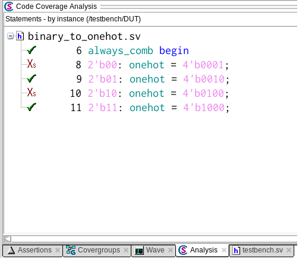
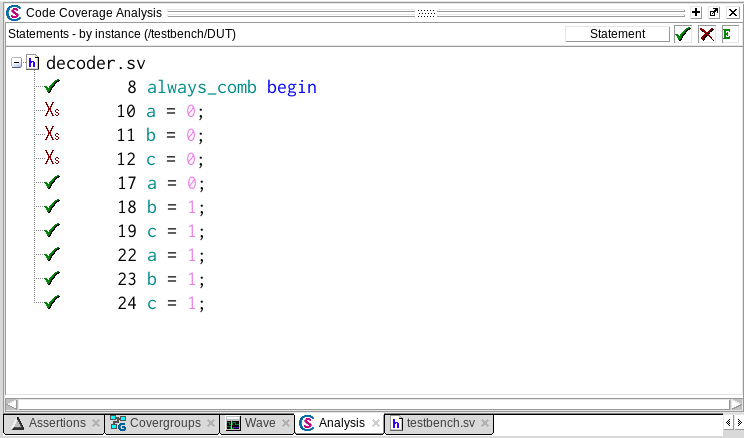
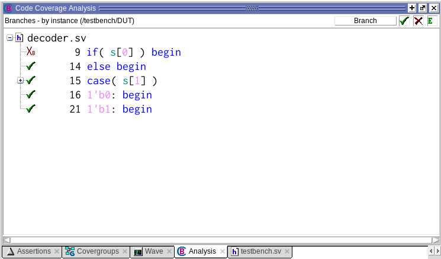
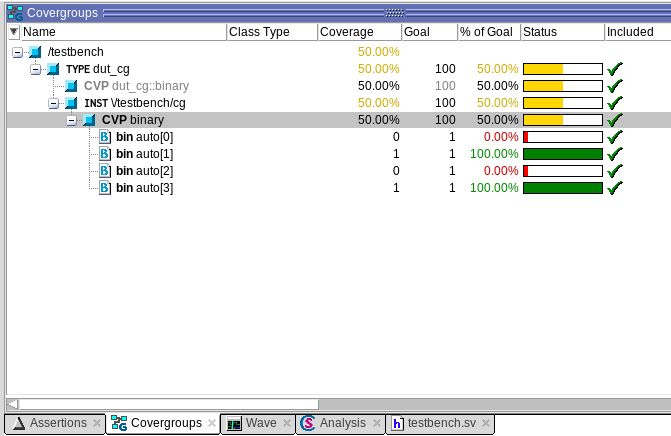
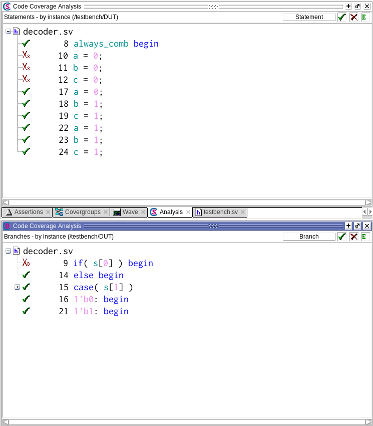
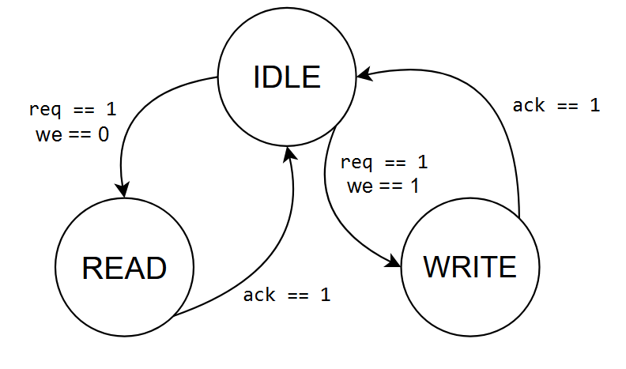
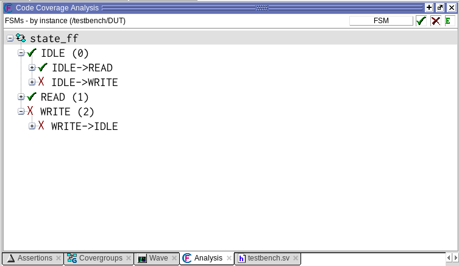
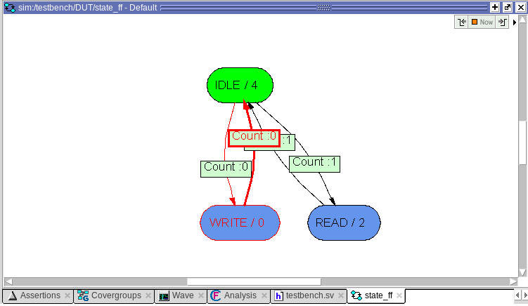
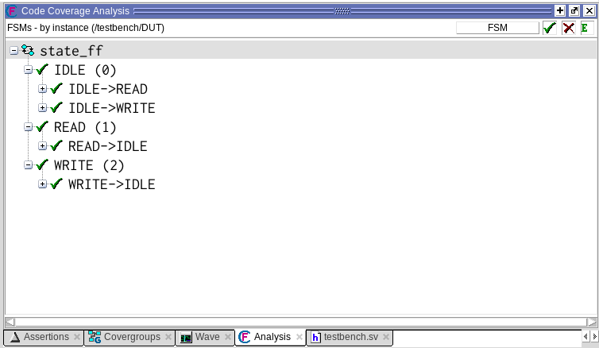

# Кодовое покрытие в функциональной верификации: все говорят, но никто не использует.

## Вступление

Приветствую тебя, дорогой читатель! **Данная заметка посвящена кодовому покрытию (англ. code coverage)**. Это одна из метрик, определяющая полноту проверки устройства. Кодовое покрытие определяет, сколько раз и какие именно участки кода были выполнены в ходе симуляции работы устройства.

Так уж сложилось, что начинающими инженерами кодовое покрытие собирается и анализируется реже, чем то же функциональное (исходя из личного опыта автора). Хотя имеет свои неоспоримые преимущества и причины, по которым этот тип покрытия  должен учитываться верификатором.

## Motivation или зачем это всё

В данной заметке я бы хотел познакомить тебя с кодовым покрытием, привести простые примеры его сбора и анализа. А еще я бы хотел показать, насколько полезным может быть включение сбора кодового покрытия в верификационный план.

Повествование будет построено по принципу "от простого к сложному", и, в основном, на примерах. Все рассуждения и пояснения касаются исключительно Verilog и SystemVerilog. VHDL не трогаем. Для симуляции работы цифровых устройств будем использовать **QuestaSim 10.7c**. Запускаться будем под **Linux CentOS 7**. Поехали!

P.S. Сопроводительные материалы (в основном код примеров и команды для запуска) теперь будут публиковаться в [GitHub в репозитории](https://github.com/serge0699/vfa). На момент публикации этой заметки, все сопроводительные материалы для нее уже загружены в репозиторий.

## Начинаем с малого

Чтобы сразу быть к контексте, разберем **простейший пример**. Сначала рассмотрим дизайн, который будем проверять, потом тестовую среду для него, потом запустим симуляцию со сбором кодового покрытия и проанализируем результаты.

### Подопытный

Конвертер двоичного кода (вход `binary`) в one-hot (выход `onehot`):

```SystemVerilog
module binary_to_onehot (
    input  logic [1:0] binary,
    output logic [3:0] onehot
);

    always_comb begin
        case(binary)
            2'b00: onehot = 4'b0001;
            2'b01: onehot = 4'b0010;
            2'b10: onehot = 4'b0100;
            2'b11: onehot = 4'b1000;
        endcase
    end

endmodule
```

### Тестирование

Напишем простой тестовый сценарий. Просто будем подавать на входы значения.

```SystemVerilog
module testbench;

    logic [1:0] binary;
    logic [3:0] onehot;

    binary_to_onehot DUT (
        .binary ( binary ),
        .onehot ( onehot )
    );

    initial begin
        binary = 2'b11;
        #10;
        binary = 2'b01;
        #10;
        $finish();
    end

endmodule
```

### Запуск

Компилируем исходники и запускаем симуляцию:

```bash
vlog *.sv
vsim testbench -coverage -voptargs="+cover=s+/testbench/DUT" -do "run -a;"
```

Передав необходимые опции в команду симуляции, мы активировали сбор одного из типов кодового покрытия - процедурного покрытия (англ. statement coverage).

Если далее в QuestaSim выбрать `View -> Coverage -> Code Coverage Analysis`, то откроется окно, в котором можно проанализировать кодовое покрытие.

Если выберем DUT в иерархии, то во вкладке `Code Coverage Analysis` увидим:

<p align="center">
</img>
</p>

При сборе такого типа кодового покрытия, ПО в ходе симуляции анализирует выполнение кода, после чего формирует отчет о том, какие процедурные выражения были выполнены. На изображении выше видим пример такого отчета. Из всех возможных выражений выполнилось 3. Почему? Давай разбираться.

### Анализ результатов

Так, ну список возможных выражений вполне понятен. Модуль состоит из одного `always_comb` блока. Внутри него `case`, в зависимости от входного значения, формирует выходное.

```SystemVerilog
    // ...
    
    always_comb begin
        case(binary)
            2'b00: onehot = 4'b0001;
            2'b01: onehot = 4'b0010;
            2'b10: onehot = 4'b0100;
            2'b11: onehot = 4'b1000;
        endcase
    end
    
    // ...
```

Блок `always_comb` выполняется при каждом изменении переменной внутри этого блока. Очевидно, что если вход `binary` изменился хоть раз в ходе симуляции, то и блок должен выполниться. Видим это в отчете (см. выше) в виде зеленой галки напротив соответствующего выражения.

Присвоение определенного значения выхода `onehot` выполняется в зависимости от значения на входе `binary`. `2'b00` соответствует `4'b0001`, `2'b01` соответствует `4'b0010` и так далее. У нас выполнилось: `2'b01: onehot = 4'b0010;`, `2'b11: onehot = 4'b1000;`. Ну так понятно, почему! Мы ведь в нашем тестбенче (см. выше) подали значения : `2'b01`, `2'b11`:

```SystemVerilog
    // ...

    initial begin
        binary = 2'b11;
        #10;
        binary = 2'b01;
        #10;
        $finish();
    end
    
    // ...
```

которые и привели к выполнению соответствующих участков кода.

[-> GitHub примера](./src/1)

## А если посложнее

Так, ну с базовым примером разобрались, теперь сделаем модуль для тестирования чуть интереснее. Алгоритм тот же, разбираем дизайн, тесты, запускаемся и анализируем результаты.

### Подопытный

Можем считать, что это некий декодер, который в зависимости от входа s определяет некоторые значения выходов `a`, `b` и `c`.

```SystemVerilog
module decoder (
    input  logic [1:0] s,
    output logic       a,
    output logic       b,
    output logic       c
);

    always_comb begin
        if( s[0] ) begin
            a = 0;
            b = 0;
            c = 0;
        end
        else begin
            case( s[1] )
                1'b0: begin
                    a = 0;
                    b = 1;
                    c = 1;
                end
                1'b1: begin
                    a = 1;
                    b = 1;
                    c = 1;
                end
            endcase
        end
    end

endmodule
```

### Тестирование

Тут все тоже тривиально. Подаем на входы значения.

```SystemVerilog
module testbench;

    logic [1:0] s;
    logic       a;
    logic       b;
    logic       c;

    decoder DUT (
        .s ( s ),
        .a ( a ),
        .b ( b ),
        .c ( c )
    );

    initial begin
        s = 2'b00;
        #10;
        s = 2'b10;
        #10;
        $finish();
    end

endmodule
```

### Запуск

Компилируем исходники и запускаем симуляцию:

```bash
vlog *.sv
vsim testbench -coverage -voptargs="+cover=sb+/testbench/DUT" -do "run -a;"
```

Передав необходимые опции, мы активировали сбор уже двух типов кодового покрытия - процедурного покрытия (_англ. statement coverage_) и покрытия ветвления (_англ. branch_coverage_).

Во вкладке `Code Coverage Analysis` увидим:

<p align="center">
</img>
</p>

Хм, в целом картина похожая. Часть выражений выполнена, а часть нет. Добавилось ли что-то новое? Да! Я хочу, чтобы ты обратил внимание на верхний правый угол. Там, где написано `Statement`. Это как раз кнопка выбора типа кодового покрытия. Если нажмем на нее, то сможем выбрать `Branch`, то есть покрытие ветвления.

<p align="center">
</img>
</p>

### Анализ результатов

Вообще, если посмотреть на оба отчета, то в нашем случае они говорят об одном и том же, просто разным "языком".

Давайте вернемся к коду тестируемого модуля.

```SystemVerilog
    // ...
        
    if( s[0] ) begin
        a = 0;
        b = 0;
        c = 0;
    end
    else begin
        case( s[1] )
            1'b0: begin
                a = 0;
                b = 1;
                c = 1;
            end
            1'b1: begin
                a = 1;
                b = 1;
                c = 1;
            end
        endcase
    end
        
    // ...
```

Что нам говорит отчет о покрытии ветвлений? Что переход `else-begin`, а также все переходы внутри `case` были выполнены. Если посмотреть код тестового сценария, то очевидно, почему. А если посмотреть на процедурный отчет, то он как раз говорит нам о том, что выполнились выражения, которые и должны были выполниться при обозначенных переходах (ну и `always_comb` в придачу).

А не выполнился только лишь переход `if-begin`, потому что в тестовом сценарии `s[0]` никогда не принимало значение `1`. А что нам говорит процедурное покрытие? Верно, не выполнились выражения, которые должны были бы выполниться при переходе `if-begin`.

[-> GitHub примера](./src/2)

## Немного теории

### Типы кодового покрытия

Так, разбирая примеры, мы с вами попутно познакомились с двумя часто используемыми типами кодового покрытия: процедурным покрытием (_англ. statement coverage_) и покрытием ветвлений (_англ. branch coverage_).

**Процедурное покрытие** предназначено для сбора информации о том, какие независимые участки кода выполнились в ходе симуляции. Сюда входит выполнение блоков `always_ff`, `always_comb`, процедуры `assign`, просто единичных присвоений `=` и так далее.

**Покрытие ветвлений** предназначено для сбора информации о том, какие условные переходы были произведены в ходе симуляции. Сюда входит анализ конструкций `if-else`, `case`, тернарных операторов.

**Существуют и другие типы, но об этом позже**. 

Замечу, что для примеров я выбрал два обозначенных выше типа кодового покрытия, так как они являются "минимальной базой", без которой практически пропадает смысл всего затеянного. А теперь, читатель, нам нужно разобраться в особенностях кодового покрытия и его отличиях от функционального.

### Сбор функционального покрытия

Для сбора функционального покрытия используются специальные конструкции SystemVerilog (`covergroup`, `coverpoint`, `bin` и т.д.). То есть, для сбора **функционального покрытия, верификатор сам пишет необходимый код**, который и определяет ту область, которую он хочет отслеживать.

Например, если тестируется модуль конвертера:

```SystemVerilog
module testbench;

    logic [1:0] binary;
    logic [3:0] onehot;

    binary_to_onehot DUT (
        .binary ( binary ),
        .onehot ( onehot )
    );

    initial begin
        binary = 2'b11;
        #10;
        binary = 2'b01;
        #10;
        $finish();
    end

endmodule
```

То для покрытия значений входа `binary` нужно внутри модуля `testbench` написать:

```SystemVerilog
    // ...
    
    covergroup dut_cg @(binary);
        coverpoint binary;
    endgroup

    dut_cg cg = new();
    
    // ...
```

После запуска тестового сценария можно будет наблюдать:

<p align="center">
</img>
</p>

То есть в ходе симуляции вход `binary` принимал 2 из 4 возможных значений. При этом мы сами описали, что хотим отслеживать именно его. Здесь еще раз замечу, что для сбора функционального покрытия, верификатор должен обладать знаниями соответствующего синтаксиса SystemVerilog.

[-> GitHub примера](./src/3)

### Сбор кодового покрытия

**Для получения кодового покрытия инженеру не нужно ничего описывать при помощи синтаксиса SystemVerilog**. Все необходимое уже имеется "под капотом" у симулятора. Верификатор просто активирует сбор при помощи определенных опций (флагов, передаваемых в команды запуска) и анализирует полученный результат.

Рассмотрим команду запуска симуляции из примера выше:

```bash
vsim testbench -coverage -voptargs="+cover=sb+/testbench/DUT" -do "run -a;"
```

Флаг `-coverage` отвечает за включение сбора кодового покрытия. Флаг `-voptargs="+cover=sb+/testbench/DUT"` отвечает за активацию процедурного покрытия (`+vcover=s`) и покрытия условий (`+vcover=b`) для экземпляра модуля с именем `DUT` (`+/testbench/DUT`).

То есть, **для настройки функционального покрытия используются конструкции SystemVerilog, а для настройки кодового покрытия используются флаги и опции симулятора.**

Заметим, что флаги кодового покрытия специфичны для конкретного ПО. А это наталкивает нас на мысль о том, что на самом деле кодовое покрытие зависит от используемого ПО (_англ. tool specific_), потому что аргументы для его сбора  определяются симулятором, который используется.

Пример аргументов кодового покрытия для QuestaSim:

```bash
-voptargs="+cover=bcesxf"
```

Пример аргументов кодового покрытия для VCS:

```bash
-cm line+cond+fsm+tgl+branch+assert
```

На самом деле, отличаются не только аргументы, но и формат представления. Также могут варьироваться и типы кодового покрытия. Об этом в разделах ниже.

### Специфичность кодового покрытия

**Сбор кодового покрытия не ограничен никаким стандартом** и специфичен для симулятора, а это значит, что здесь открывается простор для реализации различных типов, а также дополнительных опций.

Например, в QuestaSim, кроме процедурного покрытия и покрытия ветвлений, присутствуют следующие типы:

- покрытие условий (_англ. condition coverage_) - для отслеживания состояний логических выражений, определяющих условные переходы;
- покрытие выражений (_англ. expression coverage_) - для отслеживания состояний логических выражений;
- покрытие переключений (_англ. toggle coverage_) - для отслеживания изменения значения каждого бита переменных;
- покрытие состояний конечных автоматов (_англ. FSM coverage_) - для отслеживания состояний конечных автоматов;
- покрытие классов (_англ. class coverage_) - для отслеживания типов созданных объектов классов.

В качестве дополнительных опций можно выделить гибкую настройку элементов симулируемой системы, на которые будет распространяться сбор кодового покрытия (например `+/testbench/DUT`), а также сбор покрытия переключений только для портов (`-toggleportsonly`). Очевидно, что это лишь примеры опций, в реальности их гораздо больше.

### Взаимозаменяемость кодового покрытия

Набор типов кодового покрытия может варьироваться от симулятора к симулятору, однако для "большой тройки" это характерно в меньшей степени. Например, в VCS после QuestaSim я не нашел только покрытие классов. Для остальных типов же есть соответствие:

- statement coverage (Questa) - line coverage (VCS)
- branch coverage (Questa) - branch coverage (VCS)
- condition coverage, expression coverage (Questa)- conditional coverage (VCS)
- toggle coverage (Questa) - toggle coverage (VCS)
- FSM coverage (Questa) - FSM coverage (VCS)

Стоит заметить, что названия типов, конечно, не повторяются "слово в слово", а также одиночный тип одного симулятора может инкапсулировать в себе несколько типов другого. Так что, в любом случае, придется потратить некоторое время для сопоставления типов.

А вот для опций это менее характерно, здесь, "есть, где разгуляться", и у каждого симулятора они свои, хотя, конечно, есть и повторяющиеся.

### Переносимость кодового покрытия

Что если нужно "мигрировать" с одного симулятора на другой? Как обстоят дела с переносом кодового покрытия?

Для функционального покрытия в этом плане все просто: написал код на SystemVerilog, а значит он будет работать в любом симуляторе, который поддерживает необходимое подмножество языка. Сбор будет осуществляться посредством выполнения команд этого подмножества.

Для кодового покрытия есть нюансы. Так как флаги сбора, опции и типы варьируются от симулятора к симулятору, то пользователю в любом случае придется открыть соответствующую документацию (чаще всего это _User Guide_ и _Command Reference Manual_) для воспроизведения конфигурации, которая использовалась в другом симуляторе.

### Сохранение кодового покрытия

В режиме GUI в ходе симуляции и после ее завершения, пользователь может просмотреть отчет о кодовом покрытии. Вырезки из таких отчетов и были представлены при разборе примеров. Но что если инженер хочет сохранить результаты "до лучших времен". Конечно, такая возможность присутствует. Причем формат может быть разным даже в рамках одного симулятора.

Вернемся к тестированию декодера:

```SystemVerilog
module decoder (
    input  logic [1:0] s,
    output logic       a,
    output logic       b,
    output logic       c
);

    always_comb begin
        if( s[0] ) begin
            a = 0;
            b = 0;
            c = 0;
        end
        else begin
            case( s[1] )
                1'b0: begin
                    a = 0;
                    b = 1;
                    c = 1;
                end
                1'b1: begin
                    a = 1;
                    b = 1;
                    c = 1;
                end
            endcase
        end
    end

endmodule
```

После завершения симуляции в режиме GUI можем наблюдать отчет:

<p align="center">
</img>
</p>

Однако, если закрыть GUI, то результаты будут утеряны.

Для сохранения результатов в файл базы данных специального формата `.ucdb` следует добавить к команде запуска `coverage save <имя-файла>.ucdb`.

Полная команда запуска:

```bash
vsim testbench -coverage -voptargs="+cover=sb+/testbench/DUT" -do "run -a; coverage save cov.ucdb;"
```

Сохраненную базу данных сможем в любое время открыть командой:

```bash
vsim -viewcov cov.ucdb
```

[-> GitHub примера](./src/2)

Но и это еще не все. Также мы можем сформировать детализированный текстовый отчет или HTML отчет, для просмотра которого не нужен будет сам симулятор. Для этого следует добавить к команде запуска `coverage report -details -file <имя-файла>.txt` для текстового формата и `coverage report -html -details -htmldir <имя-директории>` для HTML формата.

Пример соответствующих команд:

```bash
vsim testbench -coverage -voptargs="+cover=sb+/testbench/DUT" -do "run -a; coverage report -details -file cov.txt;
```

```bash
vsim testbench -coverage -voptargs="+cover=sb+/testbench/DUT" -do "run -a; coverage report -html -details -htmldir htmlcov;"
```

Открыть можем текстовым редактором и браузером:

```bash
nano cov.txt
```

```bash
firefox htmlcov/index.html
```

[-> GitHub примеров](./src/2)

Пример HTML-отчета (но лично я предпочитаю текстовый):

<p align="center">
</img>
</p>

### Влияние сбора кодового покрытия на скорость симуляции

Сами разработчики симуляторов заявляют, что **сбор кодового покрытия может существенно замедлять скорость работы**. Не удивительно, ведь, параллельно с симуляцией каждого элемента системы, ПО высчитывает количество выполнения определенных участков кода.

В качестве примера, тест декодера на 100 миллионов случайных значений без кодового покрытия занимает 6 секунд:

```bash
time vsim -batch testbench -do "run -a;"
real	0m5.942s
user	0m5.045s
sys     0m0.079s
```

А с кодовым покрытием двух типов 14.5 секунд:

```bash
time vsim -batch testbench -coverage -voptargs="+cover=bs+/testbench/DUT" -do "run -a;"
real	0m14.514s
user	0m13.284s
sys     0m0.086s
```

Машина одна и та же.

[-> GitHub примеров](./src/7)

Так что при **сборе кодового покрытия внимательно настраивайте области, для которых хотите его осуществлять**, стараясь минимизировать работу симулятора.

Причины использовать кодовое покрытие

Так уж сложилось, что начинающими инженерами кодовое покрытие собирается и анализируется реже, чем функциональное.  Однако, у него есть свои преимущества и цели использования.

Основные **преимущества**:

- практически все за вас делает симулятор, нет необходимости писать дополнительный код на SystemVerilog;
- если есть заготовки команд для конкретного ПО, то интегрировать простейший сбор кодового покрытия - дело нескольких минут.

Основные **цели**:

- проверка задействования всего кода в ходе тестирования;
- поиск "недостающих" тестовых сценариев;
- поиск dead-code.

На целях остановимся чуть подробнее. Очевидно, когда описывается RTL устройства, то подразумевается, что каждое выражение в коде несет смысловую нагрузку и будет выполнено. Кодовое покрытие помогает в этом убедиться. 

Также, кодовое покрытие может помочь в поиске недостающих тестовых воздействий. Если часть условных переходов, выражений и т.п. не была выполнена, или, если конечный автомат был не во всех состояниях, то это наталкивает на мысли о неполноте тестовых сценариев. 

Ко всему прочему, чаще всего при рефакторинге, остается код, который не выполнится ни при каком сочетании внутреннего состояния устройства и входных воздействий на него (_англ. dead code_). Казалось бы ничего страшного, но теоретически этот код может повлиять на результаты синтеза, а также, по прошествии времени, заставит мучаться инженеров в попытках понять, зачем он нужен.

## Кодовое покрытие и обнаружение бага

Разберем простой пример, в котором кодовое покрытие поможет нам выявить неполноту тестовых воздействий и обнаружить баг. А заодно познакомимся с третьим типом кодового покрытия - покрытием состояний конечного автомата (_англ. FSM coverage_).

### Подопытный

Конечный автомат со схемой переходов:

<p align="center">
</img>
</p>

По спецификации выходы `idle`, `read`, `write` принимают значения логической единицы в соответствии с текущим состоянием автомата. То есть, если автомат в состоянии IDLE, то `idle = 1`, если в состоянии READ, то `read = 1` и так далее.

Однако же, внесем баг. Приравняем выходу `write` значение логического нуля на постоянной основе.

Исходный код:

```SystemVerilog
module fsm (

    input  logic clk,
    input  logic resetn,

    input  logic req,
    input  logic we,
    input  logic ack,
    output logic idle,
    output logic read,
    output logic write

);

    typedef enum logic [1:0] {
        IDLE  = 2'b00,
        READ  = 2'b01,
        WRITE = 2'b10
    } state_e;

    state_e nextstate, state_ff;

    assign idle  = state_ff == IDLE;
    assign read  = state_ff == READ;
    assign write = 0;

    always_ff @(posedge clk) begin
        if(!resetn) state_ff < = IDLE;
        else state_ff < = nextstate;
    end

    always_comb begin
        case(state_ff)
            IDLE: begin
                if( req ) nextstate = we ? WRITE : READ;
                else nextstate = IDLE;
            end
            READ: begin
                nextstate = ack ? IDLE : READ;
            end
            WRITE: begin
                nextstate = ack ? IDLE : WRITE;
            end
            default: nextstate = IDLE;
        endcase
    end

endmodule
```

### Тесты

Здесь осознанно не привожу полный код, чтобы не перегружать повествование. Обозначу только, что `set_inputs()` отвечает за выставление значений на входы, а `check_ouputs()` за проверку значений на выходах, а `wait_clocks()` за ожидание заданного количества положительных фронтов тактового сигнала.

```SystemVerilog
module testbench;

    // ...

    // Reset
    initial begin
        resetn < = 0;
        @(posedge clk);
        resetn < = 1;
    end
    
    // ...

    task check_outputs(logic [2:0] outputs);
        if( { idle, read, write } !== outputs )
            $error("Real: %3b, Expected: %3b",
                { idle, read, write }, outputs);
    endtask
    
    // ...

    // Generate
    initial begin
        // Set initial values
        req < = 0;
        we  < = 0;
        ack < = 0;
        // Wait for unreset
        do wait_clocks(1); while(!resetn);
        // Check for idle state
        check_outputs(3'b100); // idle: 1, read: 0, write: 0
        // Check some transitions
        // 1
        set_inputs(3'b100); wait_clocks(2); // req: 1, we: 0, ack: 0
        check_outputs(3'b010); // idle: 0, read: 1, write: 0
        // 2
        set_inputs(3'b001); wait_clocks(2); // req: 0, we: 0, ack: 1
        check_outputs(3'b100); // idle: 1, read: 0, write: 0
        // 
        $finish();
    end

endmodule
```

### Запуск

Компилируем исходники и запускаем симуляцию:

```bash
vlog *.sv
vsim testbench -coverage -voptargs="+acc +cover=f+/testbench/DUT" -do "run -a;"
```

Передав необходимые опции, мы активировали сбор кодового покрытия состояний конечного автомата (_англ. FSM coverage_).

Симуляция завершается без ошибок:

```
# Loading sv_std.std
# Loading work.testbench(fast)
# Loading work.fsm(fast)
# run -a
# ** Note: $finish    : testbench.sv(73)
#    Time: 115 ns  Iteration: 1  Instance: /testbench
```

### Анализ результатов

Во вкладке Code Coverage Analysis переключимся на FSM на увидим:

<p align="center">
</img>
</p>

Очевидно, что не были совершены переходы IDLE -> WRITE и WRITE -> IDLE.

Если два раза кликнуть на `state_ff`, то откроется диаграмма переходов, на ней тоже явно можем увидеть количество переходов между состояниями. Примечательно, что симулятор, проанализировав код, сам сделал выводы о том, какие переходы возможны, а какие нет. Красота!

<p align="center">
</img>
</p>

[-> GitHub примера](./src/4)

### Исправляемся

Допишем тестовый сценарий для инициации нужных переходов:

```SystemVerilog
    // ...

    // Generate
    initial begin
        // ...
        // 3
        set_inputs(3'b110); wait_clocks(2); // req: 1, we: 1, ack: 0
        check_outputs(3'b001); // idle: 0, read: 0, write: 1
        // 4
        set_inputs(3'b001); wait_clocks(2); // req: 0, we: 0, ack: 1
        check_outputs(3'b100); // idle: 1, read: 0, write: 0
        // 
        $finish();
    end
    
    // ...
```

Обнаружили баг:

```
# Loading sv_std.std
# Loading work.testbench(fast)
# Loading work.fsm(fast)
# run -a
# ** Error: Real: 000, Expected: 001
#    Time: 75 ns  Scope: testbench.check_outputs File: testbench.sv Line: 46
# ** Note: $finish    : testbench.sv(78)
#    Time: 95 ns  Iteration: 1  Instance: /testbench
```

Смотрим теперь на покрытие состояний:

<p align="center">
</img>
</p>

Все переходы были совершены.

[-> GitHub примера](./src/5)

Исправляем RTL:

```SystemVerilog
    assign write = state_ff == WRITE;
```

Запускаемся снова. Результат - без ошибок:

```
# Loading sv_std.std
# Loading work.testbench(fast)
# Loading work.fsm(fast)
# run -a
# ** Note: $finish    : testbench.sv(78)
#    Time: 115 ns  Iteration: 1  Instance: /testbench
```

Мы прекрасны!

[-> GitHub примера](./src/6)

## Заключение

Что ж, дорогой читатель, вот мы и добрались до конца. Было ли интересно? Лично мне - да. Потому что, "стыдно признаться, грех утаить", а я и сам достаточно давно не собирал кодовое покрытие:) Исправлюсь, обещаю.

Надеюсь, прочитав текст выше, ты открыл для себя что-то новое.

Спасибо тебе за уделённое время. Всего наилучшего и до новых встреч!

А больше подобных заметок ты можешь найти в Telegram-канале автора [Verification For All](https://t.me/verif_for_all).
