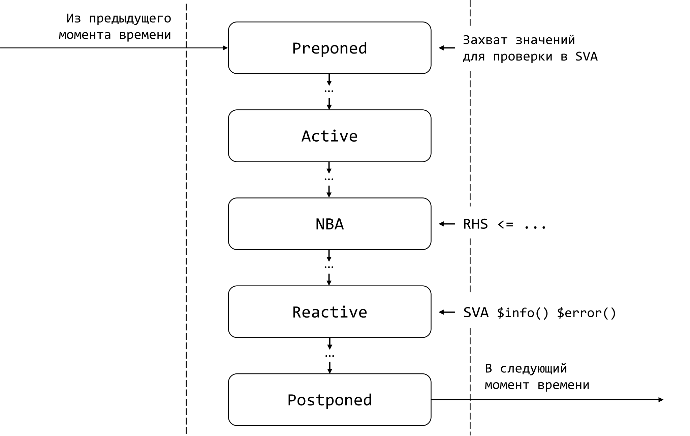

# SystemVerilog Gotchas, Tips and Tricks, часть 1

- [SystemVerilog Gotchas, Tips and Tricks, часть 1](#systemverilog-gotchas-tips-and-tricks-часть-1)
  - [Вступление](#Вступление)
    - [Цикл статей SystemVerilog Gotchas, Tips and Tricks](#Цикл-статей-systemverilog-gotchas-tips-and-tricks)
    - [Motivation или зачем это всё](#motivation-или-зачем-это-всё)
  - [Рандомизация переменных ширины более 32 бит](#Рандомизация-переменных-ширины-более-32-бит)
  - [Индексация данных при упаковке](#Индексация-данных-при-упаковке)
  - [Завершение потоков через disable fork](#Завершение-потоков-через-disable-fork)
  - [SystemVerilog concurrent assertions и event regions](#systemverilog-concurrent-assertions-и-event-regions)
    - [Начнем с примера](#Начнем-с-примера)
    - [О SystemVeriog event regions](#О-systemveriog-event-regions)
    - [Системные функции `$past()` и `$sampled()`](#Системные-функции-past-и-sampled)
  - [Тонкости `fork-join_none`](#Тонкости-fork-join_none)
    - [Несовершенство обучающих материалов](#Несовершенство-обучающих-материалов)
    - [Продолжим примером](#Продолжим-примером)
    - [`fork-join_none` и стандарт SystemVerilog](#fork-join_none-и-стандарт-systemverilog)
    - [И снова пример](#И-снова-пример)
    - [Неужели это так важно?](#Неужели-это-так-важно)
  - [Совместный запуск последовательностей на массиве агентов](#Совместный-запуск-последовательностей-на-массиве-агентов)
    - [Функциональная верификация межсоединений](#Функциональная-верификация-межсоединений)
    - [Продолжим примером](#Продолжим-примером-1)
    - [Разбираемся с промежуточными переменными](#Разбираемся-с-промежуточными-переменными)
  - [To be continued...](#to-be-continued)


## Вступление

### Цикл статей SystemVerilog Gotchas, Tips and Tricks

Доброго времени суток, дорогие читатели! Данная статья является первой в целом цикле, который называется **SystemVerilog Gotchas, Tips and Tricks**. В нем я буду делиться интересными  особенностями языка SystemVerilog и тем, как они могут проявляться в ходе функциональной верификации и как по возможности избежать негативных последствий этих проявлений.

### Motivation или зачем это всё

> Именно так: бед нет — есть лишь стечение более сложных и по-своему более критических обстоятельств. Я так и определяю для себя беду: стечение сложных обстоятельств.
>
> Юрий Петрович Власов

Инженер в процессе обучения или разработки может сталкиваться с множеством препятствий. Одними из самых трудозатратных являются те, что связаны со скрытыми от поверхностного взгляда особенностями языка SystemVerilog. Для их преодоления могут потребоваться часы размышлений, отладки и чтения стандарта.

Автор имеет обширный опыт обучения начинающих и со временем пришел к выводу, что подавляющая часть ошибок практически один в один копируется от инженера к инженеру. Разумеется, не в прямом смысле. Тем не менее, каждый юный верификатор сталкивается с абсолютно типичным набором проблем.

Цель создания данного цикла статей — предупредить ошибки новичка и сохранить его ментальное здоровье. А если более серьезно и глобально — создать пособие, к которому можно будет обратиться в случае столкновения с новым и совершенно непонятным поведением верификационного окружения. Получится ли? Покажет ~~время~~ ваша обратная связь!


## Рандомизация переменных ширины более 32 бит

Функции `$urandom()` и `$urandom_range()` в SystemVerilog возвращают случайный `unsigned int`, разрядность которого 32 бита. Так что рандомизация переменных шириной более 32 бит за 1 вызов этих функций невозможна (будет срандомизирована лишь младшая 32-битная часть).

```verilog
typedef bit [63:0] data_t;

initial begin
    data_t data;
    repeat(3) begin
        data = $urandom(); $display("%h", data);
    end
end
```

Результат запуска симуляции:

```
00000000ce46aa23
00000000a01b6e32
000000005cb53a0a
000000008b4e9f1d
00000000a80385b8
```

Для рандомизации переменных шириной более 32 бит можно использовать либо конкатенацию `$urandom()`/`$urandom_range()`, либо функцию `std::randomize()`.


```verilog
typedef bit [63:0] data_t;

initial begin
    data_t data;
    repeat(3) begin
        data = {$urandom(), $urandom()}; $display("%h", data);
        void'(std::randomize(data));     $display("%h", data);
    end
end
```

Результат запуска симуляции:

```
ce46aa23a01b6e32
8b4e9f1d5cb53a0a
a80385b869968eda
e0a228ac13c11ac0
913a793217e9241c
12f806fda3ea30be
```

Пример с комментариями: [`src/test/rand_width.sv`](https://github.com/serge0699/vfa/blob/master/articles/gotchas_0/src/test/rand_width.sv).

Запуск примера в QuestaSim:

```bash
./run_questa.sh rand_width
```

На момент написания статьи Verilator (v5.035) не поддерживает `std::randomize()`. [Соответствующий issue](https://github.com/verilator/verilator/issues/5438).


## Индексация данных при упаковке

При упаковке данных в SystemVerilog часто можно столкнуться с тем, что **индексы, которые определяют интервал бит, должны быть compile-time или elaboration-time константами**. То есть их значения должны быть известны симулятору на этапе компиляции или элаборации, которые предшествуют этапу симуляции. Иными словами, значения индексов не могут динамически изменяться в ходе симуляции.

То есть нет возможности написать, например, конструкцию:

```verilog
byte    data [];
longint word;

for(int i = 0; i < 8; i = i + 1) begin
    word[i] = data[(i+1)*8-1:i*8];
end
```

Для упаковки данных в SystemVerilog можно использовать **streaming operator**:

```verilog
byte    data [];
longint word;

initial begin
    data = new[8]('{8'hfa, 8'hde, 8'hca, 8'hfe,
                    8'hde, 8'had, 8'hbe, 8'hef});
    word = {>>{data}};
    $display("word: %h", word);
    word = {<<8{data}};
    $display("word: %h", word);
end
```

Результат запуска симуляции:

```
fadecafedeadbeef
efbeaddefecadefa
```

Подробнее о streaming operator можно узнать в статье [How to Pack Data Using the SystemVerilog Streaming Operators](https://www.consulting.amiq.com/2017/05/29/how-to-pack-data-using-systemverilog-streaming-operators/) от Amiq Consulting и в стандарте SystemVerilog IEEE Std 1800-2023 в разделе 11.4.14.

Для упаковки данных в SystemVerilog также можно использовать **indexed part-select**:

```verilog
byte    data [];
longint word;

initial begin
    data = new[8]('{8'hfa, 8'hde, 8'hca, 8'hfe,
                    8'hde, 8'had, 8'hbe, 8'hef});
    foreach(data[i]) word[64-8*(i+1)+:8] = data[i];
    $display("word: %h", word);
    foreach(data[i]) word[8*i+:8] = data[i];
    $display("word: %h", word);
end
```

Результат запуска симуляции:

```
fadecafedeadbeef
efbeaddefecadefa
```

Подробнее об indexed part-select можно узнать в стандарте SystemVerilog IEEE Std 1800-2023 в разделе 11.5.1.

Пример с комментариями: [`src/test/data_packing.sv`](https://github.com/serge0699/vfa/blob/master/articles/gotchas_0/src/test/data_packing.sv).

Запуск примера в QuestaSim:

```bash
./run_questa.sh data_packing
```

На момент написания статьи Verilator (v5.035) некорректно определяет очередность данных для упаковки при помощи streaming operator. Автор создал [issue](https://github.com/verilator/verilator/issues/5903).


## Завершение потоков через disable fork

Пример ниже состоит из задачи `run_processes()` и блока `initial begin-end`, который запускает эту задачу. Выход из задачи происходит после завершения процесса 1. Процесс 2 при этом продолжит выполняться. Далее в блоке запускаются процессы 3 и 4. Выполнение кода продолжается после завершения процесса 3. Далее вызывается  `disable fork`, после чего запускается процесс 5.

```verilog
task run_processes();
    fork
        repeat( 3) #1 $display("Process 1");
        repeat(20) #1 $display("Process 2");
    join_any
    $display("-- Exit run_processes()");
endtask

initial begin
    run_processes();
    fork
        repeat( 3) #1 $display("Process 3");
        repeat(10) #1 $display("Process 4");
    join_any
    $display("-- Exit fork and disable it");
    disable fork;
    repeat(3) #1 $display("Process 5");
    $finish();
end
```

Результат запуска симуляции:

```
Process 1
Process 2
Process 1
Process 2
Process 1
-- Exit run_processes()
Process 2
Process 3
Process 4
Process 2
Process 3
Process 4
Process 2
Process 3
-- Exit fork and disable it
Process 5
Process 5
Process 5
```

После `disable fork` процесс 2 перестает выполняться, как и 4. Остается только 5. Получается, что `disable fork` завершает не только процессы "ближайшего" `fork`, как склонны полагать начинающие. Так на какие же процессы влияет `disable fork`? Давайте обратимся к разделу 9.6.3. стандарта SystemVerilog IEEE Std 1800-2023.

> The disable fork statement terminates all descendant subprocesses (not just immediate children) of the calling process, including descendants of subprocesses that have already terminated.

Оказывается, что **`disable fork` завершает все дочерние процессы вызывающего `disable fork` процесса**. То есть в нашем случае все процессы, созданные в `initial`, в том числе процессы, которые были созданы при вызове задачи `run_processes()`, так как она вызывалась в этом `initial`.

Пример с комментариями: [`src/test/disable_fork.sv`](https://github.com/serge0699/vfa/blob/master/articles/gotchas_0/src/test/disable_fork.sv).

Запуск примера в QuestaSim:

```bash
./run_questa.sh disable_fork
```

Запуск примера в Verilator:

```bash
./run_verilator.sh disable_fork
```

Для безопасного завершения процессов через `disable fork` можно использовать особую обертку `fork begin - end join`:

```verilog
initial begin
    run_processes();
    fork begin
        fork
            repeat( 3) #1 $display("Process 3");
            repeat(10) #1 $display("Process 4");
        join_any
        $display("-- Exit fork and disable it");
        disable fork;
    end join
    repeat(3) #1 $display("Process 5");
    $finish();
end
```

Дополнительный `fork-join` создает новый процесс, в котором запускаются процессы 3 и 4, а также вызывается `disable fork`, который принудительно завершит только процесс 4. Процесс 2 является дочерним процессом `initial`, а не процесса, созданного в `fork begin - end join`, так что он завершен не будет.

Результат запуска симуляции:

```
Process 1
Process 2
Process 1
Process 2
Process 1
-- Exit run_processes()
Process 2
Process 3
Process 4
Process 2
Process 3
Process 4
Process 2
Process 3
-- Exit fork and disable it
Process 2
Process 5
Process 2
Process 5
Process 2
Process 5
```


## SystemVerilog concurrent assertions и event regions

### Начнем с примера

Необходимо проверить заведомо сломанный модуль знакорасширения.

```verilog
module signextend(
    input  logic        clk_i,
    input  logic        aresetn_i,
    input  logic [ 7:0] data_i,
    output logic [31:0] data_o
);

    always_ff @(posedge clk_i or negedge aresetn_i) begin
        if(!aresetn_i) begin
            data_o <= 'b0;
        end
        else begin
            // NOTE: вычисление знакорасширения
            // сломано в данном примере.
            data_o <= {{23{data_i[7]}}, data_i};
        end
    end

endmodule
```

Напишем SystemVerilog `property` и инициируем его проверку через `assert property`:

```verilog
property pData;
    logic [7:0] data;
    @(posedge clk_i) disable iff(!aresetn_i)
    (1, data = data_i) ##1 data_o === {{24{data[7]}}, data};
endproperty

apData: assert property(pData) else begin
    $error("data_i was: %h, data_o is: %h",
        $past(data_i, 1), $sampled(data_o));
end
```

Каждый такт значение со входа `data_i` сохраняется во временную переменную `data` (да, в теле `property` можно объявлять переменные!). На следующем такте значение `data_o` сравнивается с знакорасширенным значением `data`.

Если знакорасширенное значение `data` на совпадает со значением `data_o` (о чем автор любезно позаботился, сломав модуль), то генерируется пользовательская ошибка. У читателя может возникнуть вопрос: что за конструкции языка `$past(data_i, 1)` и `$sampled(data_o)`? Не забегайте вперед! Дайте автору начать чуть издалека...

Пример с комментариями: [`src/test/sva_event_regions.sv`](https://github.com/serge0699/vfa/blob/master/articles/gotchas_0/src/test/sva_event_regions.sv).

Запуск примера в QuestaSim в режиме GUI:

```bash
./run_questa.sh sva_event_regions -gui
```

На момент написания статьи Verilator (v5.035) не поддерживает объявление переменной в теле `property`.

Результат запуска симуляции:

```
# ** Error: data_i was: a4, data_o is: 7fffffa4
#    Time: 75 ns Started: 65 ns  Scope: sva_event_regions.apData
# ** Error: data_i was: c6, data_o is: 7fffffc6
#    Time: 85 ns Started: 75 ns  Scope: sva_event_regions.apData
# ** Error: data_i was: 9e, data_o is: 7fffff9e
#    Time: 95 ns Started: 85 ns  Scope: sva_event_regions.apData
```

Посмотрим на первое сообщение об ошибке. Оно гласит, что в момент `65ns` значение `data_i` было равно `a4`, а в момент `75ns` его знакорасширенное значение `data_o` равно `7fffffa4`. Генерация ошибки ожидаема, так как модуль заведомо сломан автором.

Давайте внимательно взглянем на временную диаграмму:


В моменты времени `65ns` и `75ns` вход `data_i` и выход `data_o` меняются по положительному фронту `clk_i`. Моменты изменения сигналов в ходе симуляции SystemVerilog уже принесли и продолжают приносить ощутимые неприятности инженерам по всему миру. И concurrent assertions — не исключение. Давайте подробнее!

### О SystemVeriog event regions

На изображении ниже представлена авторская упрощенная версия схемы регионов выполнения, которые последовательно выполняются в рамках каждого момента времени симуляции, содержащего события. Подробнее про регионы выполнения можно узнать в стандарте SystemVerilog IEEE Std 1800-2023 в разделе 4. Также данная тема освещена в [одной из лекций автора](https://youtu.be/d5VjAqGpBvI?list=PLi3mfxNhwAi-Jul8__xY9Nhig8DZNxJFZ&t=5385) в [школе синтеза цифровых схем](https://engineer.yadro.com/chip-design-school/), и еще более подробно уже в [другой лекции автора](https://youtu.be/9lZ_fpcos6g?list=PLi3mfxNhwAi-Jul8__xY9Nhig8DZNxJFZ&t=1605) там же.



Из предыдущего момента времени (time slot) симулятор переходит к preponed регион текущего момента времени. В данном регионе в том числе считываются значения переменных для проверки в concurrent assertions (см. SystemVerilog IEEE Std 1800-2023 раздел 16.5.1). **Фиксируем: значения переменных для проверки в concurrent assertions считываются в самом начале момента времени.**

Через несколько иных регионов выполняется Active регион, где в том числе рассчитываются значения в комбинационной логике. После еще нескольких регионов в NBA (Nonblocking Assignment) регионе значения с комбинационной логики защелкиваются в последовательностную.

После выполнения других регионов после NBA симулятор попадает в Reactive регион, где, при наличии ошибки в concurrent assertion, генерирует либо implementation-specific ошибку, либо выполняет пользовательский код в ветви `else` в `assert property`, если такая ветвь присутствует (см. SystemVerilog IEEE Std 1800-2023 раздел 16.4.1). Присутствие ветви `else` — как раз случай из представленного ранее примера!

Итак, вооружившись теорией, продолжаем разбирать пример.

### Системные функции `$past()` и `$sampled()`

Вернемся к временной диаграмме. Продублирую ее ниже для удобства читателя.


Вспомним, что в моменты времени `65ns` и `75ns` вход `data_i` и выход `data_o` меняются по положительному фронту `clk_i`. 

Обратим внимание на момент времени `65ns`. Вход `data_i` меняет свое значение с `a4` на `c6`. Для проверки в `property` фиксируется значение `a4` в Preponed регионе. Значение `c6` защелкнется в `data_i` в NBA регионе, который идет после Preponed.

Обратим внимание на момент времени `75ns`. Выход `data_o` меняет свое значение с `7fffffa4` на `7fffffс6`. Для проверки в `property` по аналогии с моментом времени `65ns` фиксируется значение `7fffffa4`.

Проверка не проходит (модуль сломан автором), ведь знакорасширенное значение должно быть `ffffffa4`. Это отражено в результате запуска:

```
# ** Error: data_i was: a4, data_o is: 7fffffa4
#    Time: 75 ns Started: 65 ns  Scope: sva_event_regions.apData
```

Давайте попробуем убрать `$sampled()` из кода ошибки:

```verilog
apData: assert property(pData) else begin
    $error("data_i was: %h, data_o is: %h",
        $past(data_i, 1), data_o);
end
```

Результат запуска симуляции:

```
# ** Error: data_i was: a4, data_o is: 7fffffс6
#    Time: 75 ns Started: 65 ns  Scope: sva_event_regions.apData
```

Интересно! Значение `data_o` в выводе изменилось на `7fffffc6`, которое соответствует результату для значения `data_i`, равного `c6`. Но, зная теорию из [раздела выше](#О-systemveriog-event-regions), мы можем объяснить такое певедение симулятора. Ведь выполнение ветви `else` происходит в Reactive регионе, после обновление выхода `data_o` в NBA регионе. Соответственно значение `data_o` для вывода берется уже обновленное! 

Так какую же роль играет системная функция `$sampled()`. Не трудно догадаться — функция возвращает значение переменной в Preponed регионе. То значение, которое было использовано при в проверке в concurrent assertion. Такие значения в контексте assertions в стандарте SystemVerilog называются сэмплированными (англ. sampled).

С системной функцией `$past()` все еще проще. Вызов `$past(val, n)` возвращает значение переменной `val`, сэмплированное на `n` тактов во времени ранее. **Совет: при генерации пользовательских ошибок в concurrent assertions используйте `$sampled()` и `$past()` для вывода значений переменных**. 


## Тонкости `fork-join_none`

### Несовершенство обучающих материалов

В подавляющем большинстве обучающих материалов по SystemVerilog (в особенности открытых) про `fork-join_none` можно увидеть формулировку, похожую на:

> As in the case of `fork-join` and `fork-join_any` fork block is blocking, but in case of `fork-join_none` fork block will be non-blocking. Processes inside the `fork-join_none` block will be started at the same time, fork block will not wait for the completion of the process inside the `fork-join_none`.

или:

> A `fork` and `join_none` will allow the main thread to resume execution of further statements that lie after the fork regardless of whether the forked threads finish. If five threads are launched, the main thread will resume execution immediately while all the five threads remain running in the background.

Цитаты взяты с популярных тематических сайтов [ChipVerify](https://www.chipverify.com/systemverilog/systemverilog-fork-join-none) и [VerificationGuide](https://verificationguide.com/systemverilog/systemverilog-fork-join-none/) соответственно.

Из формулировок выше можно сделать вывод, что процессы, объявленные в `fork-join_none`, запускаются и выполняются совместно с выражениями в родительском процессе (в котором был объявлен `fork-join_none`).

К сожалению, формулировки выше, а, следовательно, и вывод из них, неверны. И вот почему!

### Продолжим примером

```verilog
module fork_join_none;

    initial begin
        $display("Statement 1");
        fork
            $display("Process 1");
        join_none
        $display("Statement 2");
        $display("Statement 3");
        $display("Statement 4");
    end

endmodule
```

Исходя из формулировок выше вывод симулятора будет не определен, так как процесс `$display("Process 1")` запускается совместно с `$display` после `join_none`. Подробнее про недетерменированность можно узнать в стандарте SystemVerilog IEEE Std 1800-2023 в разделе 4.7.

Однако, любой симулятор большой тройки (Siemens QuestaSim, Synopsys VCS, Cadence Xcelium) выведет результат запуска симуляции:

```
Statement 1
Statement 2
Statement 3
Statement 4
Process 1
```

Да, разумеется, читатель может сказать, что симуляторы зачастую вносят дополнительную детерменированность там, где ее не должно быть. В этом случае, независимо от условий запуска (время, зерно рандомизации и т.д.), можно наблюдать одно и то же поведение, хотя согласно стандарту языка такое поведение не является обязательным. Однако это не наш случай, и сейчас я расскажу почему!

### `fork-join_none` и стандарт SystemVerilog

Давайте обратимся к разделу 9.3.2. стандарта SystemVerilog IEEE Std 1800-2023. Внимателно посмотрим на таблицу 9-1.


Пока противоречий с формулировками выше не наблюдаются. Процесс, вызвавший, `fork-join_none` продолжает выполняться совместно с процессами, созданными в `fork-join_none`. Однако обратим внимание на предложение после таблицы. Как на зло оно еще и на другой странице...

> In all cases, processes spawned by a fork-join block shall not start executing until the parent process is blocked or terminates.

Это очень важное замечание, которое гласит, что **процессы в любом блоке `fork-join` не должны быть запущены до момента, пока процесс, вызвавший `fork-join`, не заблокируется или не завершится**. Если с завершением все понятно, то что значит заблокируется? В данном контексте заблокируется — выполнит блокирующее выражение. Но что значит блокирующее выражение?

Согласно Annex P стандарта SystemVerilog IEEE Std 1800-2023:

> **blocking statement:** A construct having the potential to suspend a process. This potential is determined through lexical analysis of the source syntax alone, not by execution semantics. For example, the statement wait(1) is considered a blocking statement even though evaluation of the expression '1' will be true at execution.

То есть **блокирующее выражение — это выражение, которое, исходя из синтаксиса, может привести к остановке процесса**. Это может быть `wait()`, `@`, `# =`. Также блокирующими выражениями являются `join` и `join_any`. Ведь они блокируют поток, вызвавший `fork` до завершения всех или одного процесса в `fork` соответственно.

Вернемся к уточнению в стандарте:

> In all cases, processes spawned by a fork-join block shall not start executing until the parent process is blocked or terminates.

С `fork-join` и `fork-join_any` все понятно, они сами по себе блокируют родительский процесс, который их вызывал, а процессы в `fork` начинают выполняться. А что с `fork-join_none`?

### И снова пример

```verilog
module fork_join_none;

    initial begin
        $display("Statement 1");
        fork
            $display("Process 1");
        join_none
        $display("Statement 2");
        $display("Statement 3");
        $display("Statement 4");
    end

endmodule
```

Однозначно определенный результат запуска симуляции:

```
Statement 1
Statement 2
Statement 3
Statement 4
Process 1
```

Такой результат обсусловлен тем, что процесс `$display("Process 1")` по стандарту должен начать выполняться в момент когда родительский `initial` начнет выполнять блокирующее выражение или завершится. В примере все `$display()` после `join_none` не являются блокирующими выражениями. Родительский `initial` завершится, после чего процесс в `fork_join_none` начнет свое выполнение. То есть вывод `Process 1` будет сделан после всех остальных выводов в примере.

Пример с комментариями: [`src/test/fork_join_none.sv`](https://github.com/serge0699/vfa/blob/master/articles/gotchas_0/src/test/fork_join_none.sv).

Запуск примера в QuestaSim:

```bash
./run_questa.sh fork_join_none
```

На момент написания статьи Verilator (v5.035) некорректно выполняет код примера, выполняя вывод `Process 1` до завершения родительского `initial`. Автор создал [issue](https://github.com/verilator/verilator/issues/5902).

### Неужели это так важно?

Читатель может усомниться в необходимости знания таких тонкостей в поведении конструкций SystemVerilog и предположить, что в реальных проектах вероятность столкнуться с таким поведением крайне мала. К сожалению, это не так. Показательный пример представлен уже в следующем разделе.


## Совместный запуск последовательностей на массиве агентов

### Функциональная верификация межсоединений

В современных СнК для соединения множества функциональных блоков между собой используются межсоединения шин (англ. interconnect), которые маршрутизируют потоки данных между блоками. Типовая структурная схема СнК с межсоединением на основе интерфейса [AXI4](https://developer.arm.com/documentation/ihi0022/latest/) представлена на изображении ниже.

<center></img></center>

Для верификации межсоединений в большинстве случаев проектируются верификационные окружения, имитирующие обмен данными между множеством функциональных блоков. Типовая структурная схема такого верификационного окружения представлена на изображении ниже.

<center></img></center>

На схеме компоненты типа `Agent` (Агент) получают высокоуровневые транзакции записи/чтения от `Sequence` (последовательностей) и отправляют их на входные порты тестируемого межсоединения `DUT`. Абстракции в виде агентов и последовательностей активно используются в [универсальной методологии верификации (Universal Verification Methodology, UVM)](https://en.wikipedia.org/wiki/Universal_Verification_Methodology), о которой вы можете подробнее узнать в [цикле статей автора Demistifying UVM](https://t.me/verif_for_all/24).

### Продолжим примером

Пример UVM-класса теста для верификации межсоединения представлен ниже.

```verilog
class icon_test extends uvm_test;

    `uvm_component_utils(icon_test)

    icon_agent ag  []; int ag_num;
    icon_seq   seq [];

    ...

    virtual function void build_phase(uvm_phase phase);
        void'(uvm_resource_db#(int)::read_by_name(
            get_full_name(), "ag_num", ag_num));
        ag = new[ag_num];
        foreach(ag[i]) begin
            ag[i] = icon_agent::type_id::create(
                $sformatf("ag_%0d", i), this);
        end
    endfunction

    virtual task main_phase(uvm_phase phase);
        phase.raise_objection(this);
        seq = new[ag_num];
        foreach(seq[i]) begin
            seq[i] = icon_seq::type_id::create(
                $sformatf("seq_%0d", i));
        end
        foreach(seq[i]) begin
            fork
                int j = i;
                seq[j].start(ag[j].sqr);
            join_none
        end
        wait fork;
        phase.drop_objection(this);
    endtask

endclass
```

Класс содержит динамический массив агентов и последовательностей для них. В методе `build_phase()` создаются агенты в зависимости от настройки `ag_num`, полученной извне. В методе `main_phase()` создаются последовательности, и каждая из них запускается на своем агенте, после чего запускается ожидание завершения каждой из последовательностей при помощи `wait fork`. Код запуска последовательностей рассмотрим подробнее.

```verilog
foreach(seq[i]) begin
    fork
        int j = i;
        seq[j].start(ag[j].sqr);
    join_none
end
wait fork;
```

Особый интерес представляет строка `int j = i;`, отвечающая за создание новой переменной, в которую копируется значение итератора. Но зачем это делать? Ведь итератор можно использовать напрямую, без промежуточной переменной. Но можно ли? Давайте обо всем по порядку!

Все последовательности запускаются совместно через `fork-join_none` для полноценной нагрузки межсоединения со стороны различных функциональных блоков. `i`-ая последовательность запускается на `i`-ом агенте.

Пример с комментариями: [`src/test/fork_join_seqs.sv`](https://github.com/serge0699/vfa/blob/master/articles/gotchas_0/src/test/fork_join_seqs.sv).

Запуск примера в QuestaSim:

```bash
./run_questa.sh fork_join_seqs
```

На момент написания статьи Verilator (v5.035) не поддерживает UVM. Текущий статус поддержки можно посмотреть в [соответствующем issue](https://github.com/verilator/verilator/issues/1538).

Результат запуска симуляции:

```
@ 0:  uvm_test_top.ag_0.drv [drv] Got item: addr: f7, data: 13a33d07
@ 0:  uvm_test_top.ag_1.drv [drv] Got item: addr: 50, data: ebf57900
@ 0:  uvm_test_top.ag_2.drv [drv] Got item: addr: d1, data: 1864b414
@ 0:  uvm_test_top.ag_3.drv [drv] Got item: addr: 10, data: 3c257344
@ 0:  uvm_test_top.ag_4.drv [drv] Got item: addr: 73, data: 0c784afa
@ 0:  uvm_test_top.ag_5.drv [drv] Got item: addr: 43, data: 8d248e59
@ 10: uvm_test_top.ag_5.drv [drv] Got item: addr: ba, data: 8aa33156
@ 12: uvm_test_top.ag_4.drv [drv] Got item: addr: 8a, data: 330f55a7
@ 16: uvm_test_top.ag_2.drv [drv] Got item: addr: 80, data: 02aa1ac7
@ 18: uvm_test_top.ag_3.drv [drv] Got item: addr: 1f, data: 26a9b0ca
@ 19: uvm_test_top.ag_0.drv [drv] Got item: addr: f9, data: 62c70ec5
@ 20: uvm_test_top.ag_1.drv [drv] Got item: addr: c0, data: 447628cb
```

Вложенный в класс агента класс драйвера информирует об обработке транзакций каждой из последовательностей. Обратите внимание, что транзакции обрабатываются разными агентами, это видно по их иерархическому имени. Также обратите внимание, что первые транзакции агенты получают одновременно в нулевой момент времени, это говорит об одновременной их отправке из последовательностей. Следующие транзакции агенты получают неодновременно из-за различных задержек взаимодействия с портами верифицируемого устройства.

### Разбираемся с промежуточными переменными

Давайте уберем промежуточную переменную `j`:

```verilog
foreach(seq[i]) begin
    fork
        seq[i].start(ag[i].sqr);
    join_none
end
wait fork;
```

Результат запуска симуляции:

```
# ** Fatal: (SIGSEGV) Bad handle or reference.
#    Time: 0 ns  Iteration: 120  Process: /icon_dv_pkg::icon_test::main_phase
# Fatal error in Task icon_dv_pkg/icon_test::main_phase at ./test/fork_join_seqs.sv
```

Неожиданно получаем ошибку доступа к памяти. Но почему? Давайте раскроем цикл, приняв размерность массивов, равной 3.

```verilog
int i = 0; // i = 0
fork
    seq[i].start(ag[i].sqr);
join_none
i = i + 1; // i = 1
fork
    seq[i].start(ag[i].sqr);
join_none
i = i + 1; // i = 2
fork
    seq[i].start(ag[i].sqr);
join_none
i = i + 1; // i = 3
wait fork;
```

А теперь, руководствуясь знаниями об особенностях исполнения `fork-join_none` из [предыдущего раздела](#тонкости-fork-join_none), обоснуем ошибку. Запуск всех `seq[i].start(ag[i].sqr)` будет выполнен, как только родительский процесс заблокируется, то есть начнет выполнять блокирующее выражение. В нашем случае это выражение `wait fork`, которое отвечает за ожидание завершения процессов в `fork`. Каким же будет значение `i` в этот момент? Верно: `i` будет равно 3. Все вызовы `seq[i].start(ag[i].sqr)` выродятся в `seq[3].start(ag[3].sqr)`. Если количество агентов равно 3, то какой максимальный индекс в массиве агентов? Тоже верно: он равен 2. Отсюда и ошибка доступа к памяти. Это ошибка доступа к несуществующему элементу массива.

А теперь вернем промежуточную переменную и снова раскроем цикл.

```verilog
int i = 0; // i = 0
fork
    int j = i; // j = 0
    seq[i].start(ag[i].sqr);
join_none
i = i + 1; // i = 1
fork
    int j = i; // j = 1
    seq[i].start(ag[i].sqr);
join_none
i = i + 1; // i = 2
fork
    int j = i; // j = 2
    seq[i].start(ag[i].sqr);
join_none
i = i + 1; // i = 3
wait fork;
```

Обратимся к разделу 9.3.2 стандарта SystemVerilog IEEE Std 1800-2023:

> Variables declared in the *block_item_declaration* of a fork-join block shall be initialized to their initialization value expression whenever execution enters their scope and before any processes are spawned.

Согласно выдержке выше, переменные, объявленные в `fork-join` блоке должны быть проинициализированы, как только симулятор в ходе выполнения "попадет" на выражение инициализации, то есть семантически его распознает. Таким образом, значения локальных переменных `j` каждого `fork-join_none` блока инициализируются еще до запуска процессов в них и сохраняют свое значение.

Во всех вызовах `seq[j].start(ag[j].sqr)` переменная `j` будет принимать соответственно значения `0`, `1` и `2`, что приведет к корректному запуску последовательностей на агентах.

## To be continued...

Первая часть цикла SystemVerilog Gotchas, Tips and Tricks подошла к концу, дорогие читатели. Следите за обновлениями в Telegram-канале автора [Verification For All (VFA)](https://t.me/verif_for_all)!

Всего вам наилучшего, дорогие читатели! Мира и процветания!☀️
