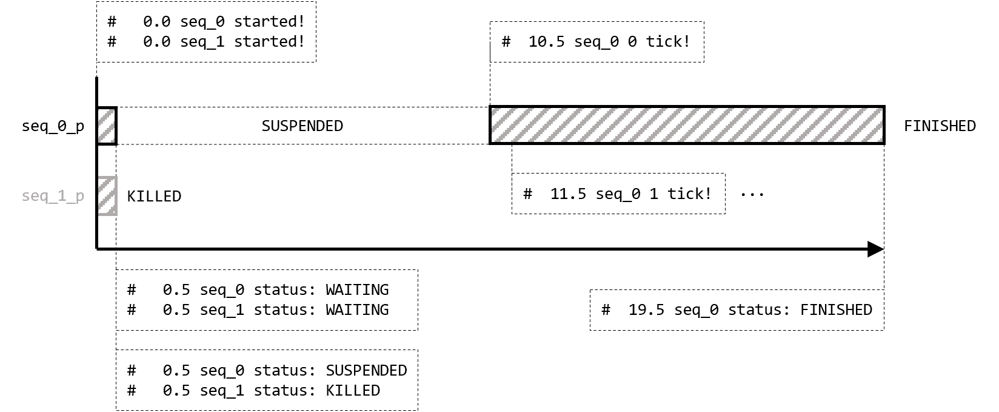

# SystemVerilog Gotchas, Tips and Tricks, часть 2

- [SystemVerilog Gotchas, Tips and Tricks, часть 2](#systemverilog-gotchas-tips-and-tricks-часть-2)
  - [О запуске примеров](#О-запуске-примеров)
  - [Вступление](#Вступление)
  - [SystemVerilog `process`](#systemverilog-process)
    - [Встроенный класс `process`](#Встроенный-класс-process)
    - [Подготовка](#Подготовка)
    - [Управляем процессами](#Управляем-процессами)
    - [Запуск примеров](#Запуск-примеров)
      - [QuestaSim](#questasim)
      - [Verilator](#verilator)
  - [SystemVerilog и стабильность рандомизации](#systemverilog-и-стабильность-рандомизации)
    - [Контекст](#Контекст)
    - [Воспроизводимость тестов](#Воспроизводимость-тестов)
    - [Генераторы случайных чисел (RNG) и их инициализация](#Генераторы-случайных-чисел-rng-и-их-инициализация)
    - [Стабильность рандомизации объектов](#Стабильность-рандомизации-объектов)
    - [Симуляторы тоже могут ошибаться](#Симуляторы-тоже-могут-ошибаться)
    - [Стабильность рандомизации потоков](#Стабильность-рандомизации-потоков)
    - [Симуляторы вновь ошибаются](#Симуляторы-вновь-ошибаются)
    - [Сохраняем стабильность рандомизации при помощи `process`](#Сохраняем-стабильность-рандомизации-при-помощи-process)
    - [При чем здесь UVM](#При-чем-здесь-uvm)
    - [Запуск примеров](#Запуск-примеров-1)
      - [QuestaSim](#questasim-1)
      - [Verilator](#verilator-1)
    - [Связанная литература](#Связанная-литература)
  - [UVM и конфигурация массива агентов](#uvm-и-конфигурация-массива-агентов)
    - [Предыстория](#Предыстория)
    - [Универсальный интерфейс и драйвер](#Универсальный-интерфейс-и-драйвер)
    - [Работаем с базой ресурсов](#Работаем-с-базой-ресурсов)
    - [Отправка массива интерфейсов в окружение](#Отправка-массива-интерфейсов-в-окружение)
    - [Запуск примеров](#Запуск-примеров-2)
      - [QuestaSim](#questasim-2)
      - [Verilator](#verilator-2)
  - [To be continued...](#to-be-continued)


## О запуске примеров

Для запуска примеров используется Siemens QuestaSim и, где это возможно, Verilator. Используемая версия UVM: 1.2.


## Вступление

Доброго времени суток, дорогие читатели! Данная статья является второй в целом цикле, который называется **SystemVerilog Gotchas, Tips and Tricks**. Первая статья [доступна по ссылке](https://serge0699.github.io/vfa/articles/gotchas_0/). В ней можете узнать, например, о [тонкостях `disable fork`](https://serge0699.github.io/vfa/articles/gotchas_0/#%D0%97%D0%B0%D0%B2%D0%B5%D1%80%D1%88%D0%B5%D0%BD%D0%B8%D0%B5-%D0%BF%D0%BE%D1%82%D0%BE%D0%BA%D0%BE%D0%B2-%D1%87%D0%B5%D1%80%D0%B5%D0%B7-disable-fork) и [методах `$past()` и `$sampled()`](https://serge0699.github.io/vfa/articles/gotchas_0/#systemverilog-concurrent-assertions-%D0%B8-event-regions).

О мотивации автора к созданию данного цикла статей вы можете также [прочитать в первой из них](https://serge0699.github.io/vfa/articles/gotchas_0/#motivation-%D0%B8%D0%BB%D0%B8-%D0%B7%D0%B0%D1%87%D0%B5%D0%BC-%D1%8D%D1%82%D0%BE-%D0%B2%D1%81%D1%91), а мы не будем долго задерживаться на вступлении и познакомимся с новой порцией интересных нюансов в любимом нами языке описания и верификации аппаратуры. Без лишних слов, давайте разбираться!


## SystemVerilog `process`

### Встроенный класс `process`

В SystemVerilog присутствует возможность контролировать отдельные процессы и получать информацию об их состоянии. Реализуется данный функционал при помощи встроенного класса `process`. Его прототип в стандарте SystemVerilog IEEE Std 1800-2023 представлен в разделе 9.7.

```verilog
class :final process;
    typedef enum {FINISHED, RUNNING, WAITING, SUSPENDED, KILLED} state;

    static function process self();
    function state status();
    function void kill();
    task await();
    function void suspend();
    function void resume();
    function void srandom(int seed);
    function string get_randstate();
    function void set_randstate(string state);
endclass
```

### Подготовка

Создадим пример. Объявим класс `seq`, выводящий при помощи метода `start()` информацию о времени симуляции:

```verilog
module sv_process;

    timeunit 1ns;
    timeprecision 100ps;

    class seq;

        string name;

        function new(string name);
            this.name = name;
        endfunction

        virtual task start(int delay);
            $display("%%5.1f %s started!", $realtime(), name);
            for(int i = 0; i < delay; i++) begin
                #1ns; $display("%%5.1f %s %0d tick!", $realtime(), name, i);
            end
            $display("%%5.1f %s ended!", $realtime(), name);
        endtask

    endclass

    ...

endmodule
```

Далее создадим два объекта типа `seq` и запустим отсчет совместно при помощи `fork-join_none`:

```verilog
module sv_process;

    ...

    process seq_0_p;
    process seq_1_p;

    seq seq_0;
    seq seq_1;

    fork
        begin
            seq_0_p = process::self();
            seq_0 = new("seq_0");
            seq_0.start(10);
        end
        begin
            seq_1_p = process::self();
            seq_1 = new("seq_1");
            seq_1.start(5);
        end
    join_none

    ...

endmodule
```

Для `seq_0` отсчет должен длиться 10ns, для `seq_1` 5ns. Обратите внимание на переменные типа `process`, которым мы присваиваем значение `process::self()`. Теперь при помощи переменных `seq_0_p` и `seq_1_p` мы можем управлять процессами, в которых запущены отсчеты вызовами методов `seq_0.start(10)` и `seq_0.start(5)` соответственно. Так давайте же займемся этим! Будем добавлять в наш пример новые взаимодействия с переменными процессов.

### Управляем процессами

```verilog
module sv_process;

    ...

    fork
        begin
            seq_0_p = process::self();
            seq_0 = new("seq_0");
            seq_0.start(10);
        end
        begin
            seq_1_p = process::self();
            seq_1 = new("seq_1");
            seq_1.start(5);
        end
    join_none

    #0.5ns;
    $display("%5.1f seq_0 status: %p", $realtime(), seq_0_p.status());
    $display("%5.1f seq_1 status: %p", $realtime(), seq_1_p.status());

    ...

endmodule
```

Ждем 0.5ns и выводим статусы. Результатом будет:

```
#   0.0 seq_0 started!
#   0.0 seq_1 started!
#   0.5 seq_0 status: WAITING
#   0.5 seq_1 status: WAITING
```

Метод `start()` в обоих объектах был выполнен. А что насчет статуса?

Согласно стандарту SystemVerilog IEEE Std 1800-2023:

> — **WAITING** means the process is waiting in a blocking statement.

Процессы действительно ожидают в блокирующем выражении. Это выражение – `#1ns` в первой итерации метода `start()`. Оно начало выполняться в нулевой момент времени симуляции и завершиться в момент времени 1ns.

Состояние симуляции в момент 0.5ns схематично представлено ниже.


Действуем далее.

```verilog
module sv_process;

    ...

    fork
        begin
            seq_0_p = process::self();
            seq_0 = new("seq_0");
            seq_0.start(10);
        end
        begin
            seq_1_p = process::self();
            seq_1 = new("seq_1");
            seq_1.start(5);
        end
    join_none

    #0.5ns;
    $display("%5.1f seq_0 status: %p", $realtime(), seq_0_p.status());
    $display("%5.1f seq_1 status: %p", $realtime(), seq_1_p.status());

    seq_0_p.suspend();
    seq_1_p.kill();
    $display("%5.1f seq_0 status: %p", $realtime(), seq_0_p.status());
    $display("%5.1f seq_1 status: %p", $realtime(), seq_1_p.status());

    ...

endmodule
```

Останавливаем процесс для `seq_0` при помощи `seq_0_p.suspend()`, а также принудительно завершаем процесс для `seq_1` при помощи `seq_1_p.kill()`. Выводим статус. Результатом будет:

```
...
#   0.5 seq_0 status: SUSPENDED
#   0.5 seq_1 status: KILLED
```

Процесс для `seq_0` был остановлен и может продолжить свое выполнение при вызове `resume()`.

Согласно стандарту SystemVerilog IEEE Std 1800-2023:

> — **SUSPENDED** means the process is stopped awaiting a resume.

Процесс для `seq_1` был принудительно завершен и не может продолжить свое выполнение. Вызов `kill()` для процесса также принудительно завершает порожденные им процессы.

Подтвердим два предложения выше выдержками из SystemVerilog IEEE Std 1800-2023:

> Calling `resume()` on a process that is not in the **SUSPENDED** state shall have no effect.

> The `kill()` function forcibly terminates the given process and all its descendant subprocesses, ...

Состояние симуляции в момент 0.5ns схематично представлено ниже.


Продолжим взаимодействовать с процессом для `seq_0`.

```verilog
module sv_process;

    ...

    fork
        begin
            seq_0_p = process::self();
            seq_0 = new("seq_0");
            seq_0.start(10);
        end
        begin
            seq_1_p = process::self();
            seq_1 = new("seq_1");
            seq_1.start(5);
        end
    join_none

    #0.5ns;
    $display("%5.1f seq_0 status: %p", $realtime(), seq_0_p.status());
    $display("%5.1f seq_1 status: %p", $realtime(), seq_1_p.status());

    seq_0_p.suspend();
    seq_1_p.kill();
    $display("%5.1f seq_0 status: %p", $realtime(), seq_0_p.status());
    $display("%5.1f seq_1 status: %p", $realtime(), seq_1_p.status());

    #10ns;
    seq_0_p.resume();
    seq_0_p.await();
    $display("%5.1f seq_0 status: %p", $realtime(), seq_0_p.status());
    $finish();

endmodule
```

Подождем 10ns, возобновим процесс впри помощи `seq_0_p.resume()`, подождем его завершения при помощи `await()` и выведем статус.

Полный результат запуска симуляции представлен ниже:

```
#   0.0 seq_0 started!
#   0.0 seq_1 started!
#   0.5 seq_0 status: WAITING
#   0.5 seq_1 status: WAITING
#   0.5 seq_0 status: SUSPENDED
#   0.5 seq_1 status: KILLED
#  10.5 seq_0 0 tick!
#  11.5 seq_0 1 tick!
#  12.5 seq_0 2 tick!
#  13.5 seq_0 3 tick!
#  14.5 seq_0 4 tick!
#  15.5 seq_0 5 tick!
#  16.5 seq_0 6 tick!
#  17.5 seq_0 7 tick!
#  18.5 seq_0 8 tick!
#  19.5 seq_0 9 tick!
#  19.5 seq_0 ended!
#  19.5 seq_0 status: FINISHED
```

Давайте проанализируем, что произошло после выводов `SUSPENDED` и `KILLED`.

Процесс, где запущен метод `start()` класса `seq_1`, не выполняется (нет соответствующего вывода). Конечно, мы же принудительно завершили его при помощи `kill()` в момент времени 0.5ns. Теперь об этом процессе можно забыть.

В момент времени 0.5ns (ожидание перед `suspend()`) + 10ns (ожидание после `suspend()`) = 10.5ns процесс `seq_0` разблокируется и продолжит свое выполнение. **При этом он не ждет оставшиеся 0.5ns из задержки `#1ns`, на которой был прерван, а сразу выводит информацию о времени, после чего итерации продолжаются с обозначенными задержками.**

<details><summary>Почему процесс не ждет оставшиеся 0.5ns</summary>

Подробнее рассмотрим работу с процессом `seq_0`. Мы остановили процесс в момент времени 0.5ns. Во время ожидания процессом `#1ns`. Это интересный случай, когда процесс останавливается в состоянии `WAITING`. Давайте обратимся к стандарту.

Согласно SystemVerilog IEEE Std 1800-2023:

> Suspending a process in the **WAITING** state shall cause the process to be desensitized to the event expression, wait condition, or delay expiration on which it is blocked.

В контексте стандарта данное предложение означает, что в случае вызова `suspend()` в состоянии `WAITING` процесс теряет чувствительность (desensitize) к блокирующему выражению, которого ожидает. Проще говоря, процесс перестает быть заблокированным. Но что же будет, когда после 10ns ожидания мы возобновим процесс? Давайте еще раз обратимся к стандарту.

Согласно SystemVerilog IEEE Std 1800-2023:

> Calling **resume()** on a process that was suspended while in the **WAITING** state shall resensitize the process to the event expression or to wait for the wait condition to become true or for the delay to expire.

В контексте стандарта данное предложение означает, что если процесс был остановлен при помощи `suspend()` в состоянии `WAITING`, то случае вызова `resume()` этот процесс должен восстановить чувствительность (resensitize) к блокирующему выражению, которого ожидал до `suspend()`. В нашем случае процесс должен продолжить ожидать завершения задержки.

За те 10ns, что процесс был остановлен, оставшаяся задержка в 0.5ns, очевидно, завершилась. Следовательно, после блокирования из-за `resume()`, процесс сразу разблокируется, так как задержка, блокировавшая его, уже истекла.

Интересно, что, если бы ожидание после `suspend()` было равно 300ps, то был бы получен следующий вывод:

```
#   0.0 seq_0 started!
#   0.0 seq_1 started!
#   0.5 seq_0 status: WAITING
#   0.5 seq_1 status: WAITING
#   0.5 seq_0 status: SUSPENDED
#   0.5 seq_1 status: KILLED
#   1.0 seq_0 0 tick!
#   2.0 seq_0 1 tick!
#   3.0 seq_0 2 tick!
#   4.0 seq_0 3 tick!
#   5.0 seq_0 4 tick!
#   6.0 seq_0 5 tick!
#   7.0 seq_0 6 tick!
#   8.0 seq_0 7 tick!
#   9.0 seq_0 8 tick!
#  10.0 seq_0 9 tick!
#  10.0 seq_0 ended!
#  10.0 seq_0 status: FINISHED
```

Как думаете, почему?

</details>

После завершения метода помощи `await()`, вывод статуса процесса подтверждает нам его успешное завершение (непринудительное).

Согласно стандарту SystemVerilog IEEE Std 1800-2023:

> — **FINISHED** means the process terminated normally.

Состояние симуляции в момент 19.5ns схематично представлено ниже.



Что же по поводу остальных методов класса `process`? Их мы косвенно будем использовать в [следущей теме](#systemverilog-и-стабильность-рандомизации)!

### Запуск примеров

Пример с комментариями: [`src/test/sv_process.sv`](https://github.com/serge0699/vfa/blob/master/articles/gotchas_1/src/test/sv_process.sv).

#### QuestaSim

Запуск примера для задержки после `suspend()` в 10ns:

```bash
./run_questa.sh sv_process +delay=10000 -c
```

Запуск примера для задержки после `suspend()` в 300ps:

```bash
./run_questa.sh sv_process +delay=300 -c
```

#### Verilator

На момент написания статьи Verilator (v5.040) [не поддерживает метод `suspend()` класса `process`](https://github.com/verilator/verilator/blob/f09c30df35675ebfdd96cd3e4d82763068cd160f/include/verilated_std.sv#L167).


## SystemVerilog и стабильность рандомизации

### Контекст

Для понимания темы необходимо освоить предыдущую: [SystemVerilog `process`](#systemverilog-process).

В данной теме в том числе будут использованы методы встроенного в SystemVerilog класса `process`.

### Воспроизводимость тестов

**В текущем разделе и во всех разделах ниже под словом "случайный" подразумевается "псевдослучайный".**

В ходе функциональной верификации зачастую запускаются массивы тестов (регрессии) с различными параметрами. В каждом из тестов генерируются случайные воздействия, которые могут привести к обнаружению ошибки.

Представим, что конкретный тест привел к обнаружению ошибки. В тесте генерировались случайные воздействия. Верификатор должен иметь возможность их воспроизвести. **Воспроизводимость случайных воздействий между запусками симуляции называется стабильностью рандомизации.**

Стабильности рандомизации посвящен раздел 18.14 стандарта SystemVerilog IEEE Std 1800-2023.

### Генераторы случайных чисел (RNG) и их инициализация

Согласно стандарту SystemVerilog IEEE Std 1800-2023:

> Each module instance, interface instance, program instance, and package has an initialization RNG. Each initialization RNG is seeded with the default seed. The default seed is an implementation-dependent value.

Тут все понятно. Каждый модуль, интерефейс, программа и пакет имеет генератор случайных чисел (Radnom Number Generator, RNG), состояние которого инициализируется начальным зерном рандомизации симулятора. Это зерно имеет некоторое значение по умолчанию, которое зависит от конкретного симулятора. В QuestaSim вместо значения по умолчанию можно задать пользовательское при помощи аргумента командной строки `-sv_seed`. Этот аргумент мы еще освоим на практике, но позже.

Процесс инициализации схематично представлен ниже.


Согласно стандарту SystemVerilog IEEE Std 1800-2023:

> Each thread has an independent RNG for all randomization system calls invoked from that thread. When a new dynamic thread is created, its RNG is seeded with the next random value from its parent thread. This property is called hierarchical seeding. When a static process is created, its RNG is seeded with the next value from the initialization RNG of the module instance, interface instance, program instance, or package containing the thread declaration.

Здесь тоже разобраться не сложно. Когда создается новый статический поток (при помощи `initial`, `always` и `always_*`), его генератор случайных чисел инициализируется следующим случайным числом из генератора интерфейса, программы или пакета, где этот поток объявлен. Если в статическом процессе создается динамический процесс (при помощи `fork`), то его генератор инициализируется случайным числом генератора этого статического процесса.

Дополненный процесс инициализации схематично представлен на изображении ниже. Раскрыт только `module`, для интерфейса, программы и пакета ситуация аналогичная.


Согласно стандарту SystemVerilog IEEE Std 1800-2023:

> Each class instance (object) has an independent RNG for all randomization methods in the class. When an object is created using new, its RNG is seeded with the next random value from the thread that creates the object.

Ситуация похожа на ситуацию с потоками. Когда создается новый объект при помощи `new()`, его генератор случайных чисел инициализируется случайным числом из генератора потока, где этот объект был создан.

Дополненный процесс инициализации схематично представлен на изображении ниже. Добавлено создание объектов.


### Стабильность рандомизации объектов

В стандарте явно указаны требования к сохранению стабильности рандомизации объектов.

> Object stability shall be preserved when object and thread creation and random number generation are done in the same order as before.

Для сохранения стабильности необходимо сохранение очередности создания объектов. Создание новых объектов необходимо добавлять в конец кода блоков статических и данамических потоков.

Создадим простейший пример с генерацией 4 случайных чисел:

```verilog
module sv_rand_stability;

    initial begin
        $display("%8h", $urandom());
        $display("%8h", $urandom());
        $display("%8h", $urandom());
        $display("%8h", $urandom());
    end

endmodule
```

Запустим симуляцию с конкретным начальным зерном рандомизации:

```bash
./run_questa.sh sv_rand_stability "-sv_seed 12345"
```

Результат запуска симуляции:

```
...
# bedc4ae3
# e6d8f5c9
# e34f5f73
# 680855e0
...
```

Можно повторить запуск несколько раз и убедиться, что **от запуска к запуску результат меняться не будет**, так как начальное зерно не изменяется, то есть генератор случайных чисел статического процесса (созданного при помощи `initial`) инициализируется одним и тем же значением.

Для вывода информации о состоянии генератора случайных чисел можно использовать встроенный в SystemVerilog класс `process`, разобранный в [предыдущей теме](#systemverilog-process), и его метод `get_randstate()`. В стандарте это явно указано:

> The get_randstate() method retrieves the current internal state of an object’s RNG (see 18.14 and 18.15).

Добавим вывод состояния генератора:

```verilog
module sv_rand_stability;

    initial begin
        process p;
        p = process::self();
        $display("RNG: %s", p.get_randstate());
        $display("%8h", $urandom());
        $display("RNG: %s", p.get_randstate());
        $display("%8h", $urandom());
        $display("%8h", $urandom());
        $display("%8h", $urandom());
    end

endmodule
```

Результат запуска симуляции:

```
...
# RNG: QS7fc6063ae2c8c21b8cae18c644b6c778
# bedc4ae3
# RNG: QS7fc6063ae2c8c21b87ae6edd5cb65a33
# e6d8f5c9
# e34f5f73
# 680855e0
...
```

Как можно заметить, **после рандомизации состояние генератора потока меняется**.

Давайте попробуем нарушить стабильность рандомизации. Вспомним выдержку из стандарта:

> When an object is created using new, its RNG is seeded with the next random value from the thread that creates the object.

Значит, при создании объекта RNG поток должен сгенерировать случайное число и проинициализировать им RNG объекта. Давайте создадим объект между рандомизациями чисел в `initial`. Это неизбежно приведет к изменению состояния RNG в `initial`, что в свою очередь изменит рандомизацию в нем.

```verilog
module sv_rand_stability;

    class dummy;
        rand int data;
    endclass

    initial begin
        dummy d;
        $display("%8h", $urandom());
        $display("%8h", $urandom());
        d = new();
        $display("Created dummy!");
        $display("%8h", $urandom());
        $display("%8h", $urandom());
    end

endmodule
```

Результат запуска симуляции:

```
...
# bedc4ae3
# e6d8f5c9
# Created dummy!
# 680855e0
# 918c7310
...
```

Заметим, что число `e34f5f73` пропало из вывода. Обратим внимание, что срандомизированное число, сгенерированное после создания объекта, имеет значение `680855e0`. Это значение совпадает со значением, идущим после `e34f5f73`. Видимо, для инициализации RNG объекта `d` поток `initial` использовал как раз `e34f5f73`, выполнив "скрытый" вызов `$urandom()`. Таким образом, значение `e34f5f73` было "выколото" из очереди срандомизированных чисел.

### Симуляторы тоже могут ошибаться

Давайте теперь закомментируем модификатор `rand` в определении класса `dummy`. Теперь класс не содержит случайных полей, которые могут быть срандомизированы при помощи встроенного метода класса `randomize()`.

```verilog
module sv_rand_stability;

    class dummy;
        /* rand */ int data;
    endclass

    initial begin
        dummy d;
        $display("%8h", $urandom());
        $display("%8h", $urandom());
        d = new();
        $display("Created dummy!");
        $display("%8h", $urandom());
        $display("%8h", $urandom());
    end

endmodule
```

Результат запуска симуляции:

```
...
# bedc4ae3
# e6d8f5c9
# Created dummy!
# e34f5f73
# 680855e0
...
```

Результат отличается от результата из предыдущего раздела! Можно предположить, что симулятор таким образом оптимизирует свою работу, не инициализируя RNG объектов, в которых нет случайных полей. Причем, такое поведение наблюдается в каждом из трех симуляторов: Siemens QuestaSim, Cadence Xcelium и Synopsys VCS.

Такое поведение симуляторов не соответствует стандарту языка, в котором указано, что **каждый объект** содержит RNG, который инициализируется при создании этого объекта. В примере выше инициализируется только RNG объектов со случайными полями.

Автор [задал вопрос на Stack Oveflow](https://stackoverflow.com/questions/79786540/random-stability-with-non-random-object) и получил ответ от [Dave Rich](https://www.linkedin.com/in/davidrich/) из Siemens EDA, человека широко известного в узких кругах.

Цитата из ответа:

> **This behavior is not in compliance with the LRM.** This is a frequent occurrence in our industry. Customer's don’t care about the LRM; they just want simulation results to be consistent across vendors. When one vendor has a bug or "optimization" in their tool, other vendors change their tool’s behavior to match the bug or their interpretation to secure business. I've witnessed these requests many times.

И что интересно:

> We have a growing list of "undocumented" behaviors that are now diverging from what the LRM specifies for just this one little optimization.

Такая вот большая тройка! Не будем долго заострять на этом внимание, лучше еще поговорим о потоках.

### Стабильность рандомизации потоков

В стандарте явно указаны требования к сохранению стабильности рандомизации потоков.

> ... thread stability can be achieved as long as thread creation and random number generation are done in the same order as before. When adding new threads to an existing test, they can be added at the end of a code block in order to maintain random number stability of previously created work.

Для сохранения стабильности необходимо сохранение очередности создания потоков. Нельзя менять местами `initial`, `always` и `always_*` для статических потоков и `fork` для динамических. Новые статические потоки необходимо добавлять в конец кода модулей, а новые динамические потоки в конец кода блоков статических потоков.

Вспомним пример с генерацией 4 случайных чисел:

```verilog
module sv_rand_stability;

    initial begin
        $display("%8h", $urandom());
        $display("%8h", $urandom());
        $display("%8h", $urandom());
        $display("%8h", $urandom());
    end

endmodule
```

Попробуем нарушить стабильность. Вспомним выдержку из стандарта:

> When a new dynamic thread is created, its RNG is seeded with the next random value from its parent thread.

Значит, RNG потока должен сгенерировать случайное число и проинициализировать им RNG созданного в нем потока. Давайте создадим поток динамический при помощи `fork`. Сделаем это между рандомизациями чисел в `initial`. Это неизбежно приведет к изменению состояния RNG в `initial`, что в свою очередь изменит рандомизацию в нем.

```verilog
module sv_rand_stability;

    initial begin
        $display("%8h", $urandom());
        $display("%8h", $urandom());
        fork begin
            $display("Created thread!");
            $urandom();
        end join
        $display("%8h", $urandom());
        $display("%8h", $urandom());
    end

endmodule
```

Результат запуска симуляции:

```
...
# bedc4ae3
# e6d8f5c9
# Created thread!
# 680855e0
# 918c7310
...
```

Заметим, что как и в [примере с созданием объекта](#стабильность-рандомизации-объектов), число `e34f5f73` пропало из вывода. И точно так же для инициализации RNG нового потока родительский поток `initial` использовал `e34f5f73`, выполнив "скрытый" вызов `$urandom()`. Значение `e34f5f73` было "выколото" из очереди срандомизированных чисел.

### Симуляторы вновь ошибаются

Если не вызывать `$urandom()` в динамическом потоке, то симулятор не будет инициализировать его RNG, что приведет к повторению результатов рандомизации без создания потока.

```verilog
module sv_rand_stability;

    initial begin
        $display("%8h", $urandom());
        $display("%8h", $urandom());
        fork begin
            $display("Created thread!");
        end join
        $display("%8h", $urandom());
        $display("%8h", $urandom());
    end

endmodule
```

Результат запуска симуляции:

```
...
# bedc4ae3
# e6d8f5c9
# Created thread!
# e34f5f73
# 680855e0
...
```

Данная оптимизация вносит несоответствие стандарту языка и уже [была разобрана на примере с созданием объекта](#симуляторы-тоже-могут-ошибаться).

### Сохраняем стабильность рандомизации при помощи `process`

Давайте представим ситуацию, что в рамках потока мы не можем точно сказать, будет создан объект или нет. Например, создание будет определяться из командной строки. Минимальный пример представлен ниже.

```verilog
module sv_rand_stability;

    class dummy;
        rand int data;
    endclass

    initial begin
        dummy d;
        $display("%8h", $urandom());
        $display("%8h", $urandom());
        if($test$plusargs("create_dummy")) begin
            $display("Created dummy!");
            d = new();
        end
        $display("%8h", $urandom());
        $display("%8h", $urandom());
        $finish();
    end

endmodule
```

Мы хотим при любом раскладе (и с созданием объекта, и без) получать один и тот же набор случайных значений в `$urandom()`. На помощь нам приходит встроенный класс `process`, разобранный в [предыдущей теме](#systemverilog-process), и его методы `set_randstate()` и `get_randstate()`.

Как уже было сказано в [разделе выше](#стабильность-рандомизации-объектов), метод `get_randstate()` позволяет получить состояние RNG потока. Метод `set_randstate()` позволяет установить определенное состояние RNG потока. Сохранить стабильность рандомизации для примера выше можно при помощи получения состояния RNG до предполагаемого создания объекта и его восстановления после предполагаемого создания.

```verilog
module sv_rand_stability;

    class dummy;
        rand int data;
    endclass

    initial begin
        dummy d; process p; string s;
        p = process::self();
        s = p.get_randstate();
        $display("%8h", $urandom());
        $display("%8h", $urandom());
        if($test$plusargs("create_dummy")) begin
            $display("Created dummy!");
            d = new();
        end
        p.set_randstate(s);
        $display("%8h", $urandom());
        $display("%8h", $urandom());
        $finish();
    end

endmodule
```

Запустим пример с созданием объекта:

```bash
./run_questa.sh sv_rand_stability "-sv_seed 12345 +create_dummy +save_randstate"
```

Запустим пример без создания объекта:

```bash
./run_questa.sh sv_rand_stability "-sv_seed 12345 +save_randstate"
```

Убедитесь, что в обоих случаях рандомизируются одинаковые значения.

### При чем здесь UVM

Сохранение стабильности через `*_randstate()` используется в исходном коде UVM. Если проанализировать файлы, в которых используется данный функционал, то можно сделать вывод, что `*_randstate()` используется в участках кода, на создание объектов в которых может влиять пользователь. А именно, в коде, относящемся к **логированию и базе ресурсов**.

Пример из файла `uvm_report_catcher.svh`:

```verilog
virtual class uvm_report_catcher extends uvm_callback;

    ...

    local static uvm_report_message m_orig_report_message;

    ...

    static function int process_all_report_catchers(uvm_report_message rm);
        ...
        catcher = uvm_report_cb::get_first(iter,l_report_object);
        if (catcher != null) begin
            if(m_debug_flags & DO_NOT_MODIFY) begin
                process p = process::self(); // Keep random stability
                string randstate;
                if (p != null)
                randstate = p.get_randstate();
                $cast(m_orig_report_message, rm.clone()); // ...
                if (p != null)
                    p.set_randstate(randstate);
            end
        end
        ...
    endfunction

    ...

endclass
```

В зависимости от значения поля `m_debug_flags` класса `uvm_report_catcher`, может быть выполнено или не выполнено клонирование объекта `rm`. Метод `clone()` в UVM создает новый объект. Стабильность рандомизации нарушится, если `clone()` будет выполнен. Для сохранения стабильности используется обертка из `get_randsate()` и `set_randstate()`, которая была разобрана в предыдущем разделе.

### Запуск примеров

Пример с комментариями: [`src/test/sv_rand_stability.sv`](https://github.com/serge0699/vfa/blob/master/articles/gotchas_1/src/test/sv_rand_stability.sv).

#### QuestaSim

Рандомизация:

```bash
./run_questa.sh sv_rand_stability "-sv_seed 12345"
```

Рандомизация + создание объекта:

```bash
./run_questa.sh sv_rand_stability "-sv_seed 12345 +create_dummy"
```

Рандомизация + создание потока:

```bash
./run_questa.sh sv_rand_stability "-sv_seed 12345 +create_thread"
```

Рандомизация + создание объекта + `*_randstate`:

```bash
./run_questa.sh sv_rand_stability "-sv_seed 12345 +create_dummy +save_randstate"
```

Рандомизация + создание потока + `*_randstate`:

```bash
./run_questa.sh sv_rand_stability "-sv_seed 12345 +create_thread +save_randstate"
```

#### Verilator

На момент написания статьи Verilator (v5.040) изменял состояние RNG потока при вызове `get_randstate()`. Поведение не соответствет стандарту. Автор создал [issue](https://github.com/verilator/verilator/issues/6550). Изменения были внесены в исходный код и уже находятся в ветке `master`. Коммит [`94525ca`](https://github.com/verilator/verilator/commit/94525cae5d9261ad1f3ea8f3fcf56341dd7be3fe).

Тем не менее, на момент написания статьи в Verilator (v5.040) [процессы не имеют собственных RNG, а обращаются к общему](https://github.com/verilator/verilator/blob/94525cae5d9261ad1f3ea8f3fcf56341dd7be3fe/include/verilated_std.sv#L221). Также автору до конца не понятны механизмы инициализации RNG объектов. Читатель может самостоятельно запустить примеры и убедиться в несоответствиях между Verilator и QuestaSim.

### Связанная литература

- [systemverilog.io: SystemVerilog Random Stability](https://www.systemverilog.io/verification/random-stability/);
- [Doug Smith, Random Stability in SystemVerilog](https://www.doulos.com/media/1293/snug2013_sv_random_stability_paper.pdf).


## UVM и конфигурация массива агентов

### Предыстория

В предыдущей статье цикла был разобран [особый случай](https://serge0699.github.io/vfa/articles/gotchas_0/#%D0%A1%D0%BE%D0%B2%D0%BC%D0%B5%D1%81%D1%82%D0%BD%D1%8B%D0%B9-%D0%B7%D0%B0%D0%BF%D1%83%D1%81%D0%BA-%D0%BF%D0%BE%D1%81%D0%BB%D0%B5%D0%B4%D0%BE%D0%B2%D0%B0%D1%82%D0%B5%D0%BB%D1%8C%D0%BD%D0%BE%D1%81%D1%82%D0%B5%D0%B9-%D0%BD%D0%B0-%D0%BC%D0%B0%D1%81%D1%81%D0%B8%D0%B2%D0%B5-%D0%B0%D0%B3%D0%B5%D0%BD%D1%82%D0%BE%D0%B2) совместного запуска последовательностей на множестве агентов. Вспомним, что для корректного совместного запуска последовательностей в `fork-join_none`, необходима промежуточная переменная (в примере ниже это переменная `j`).

```verilog
foreach(seq[i]) begin
    fork
        int j = i;
        seq[j].start(ag[j].sqr);
    join_none
end
wait fork;
```

Это помогает избежать ошибки доступа к памяти. Хорошо, с этим разобрались.

Однако начинающий инженер может достаточно быстро столкнуться с иной проблемой: конфигурацией массива агентов. Как прравило, каждый агент содержит драйвер, который взаимодействует с дизайном при помощи [виртуального интерфейса](https://serge0699.github.io/vfa/articles/virtual_intf/index.html). Но что, если количество подключаемых к устройству интерфейсов параметризуется, а интерфейсы при этом однотипные? Как в случае с интерконнектом. Типовая структурная схема такого верификационного окружения представлена на изображении ниже.


Давайте разберем этот случай и научимся конфигурировать драйверов в агентах каждого своим интерфейсом!

### Универсальный интерфейс и драйвер

К интерконнекту может подключаться множество устройств. Интерфейс подключения для каждого устройства, как правило, одинаковый. Упрощенный пример такого интерфейса представлен ниже. Состоит из сигнала `valid`, сингнализирующего об актуальности адреса и данных, а также из сигналов `addr` и `data` соответственно.

```verilog
interface icon_intf(input logic clk);
    logic        valid;
    logic [ 7:0] addr;
    logic [31:0] data;
endinterface
```

К интерконнекту подключаются агенты, каждый из которых содердит драйвер (в случае активного агента). Драйвер, имитирующий работу устройства, содержит указатель на интерфейс `vif`, который может получать, например, из базы ресурсов UVM. Пример представлен ниже.

```verilog
class icon_driver extends uvm_driver#(icon_seq_item);

    `uvm_component_utils(icon_driver)

    virtual icon_intf vif;

    ...

    virtual function void build_phase(uvm_phase phase);
        if(!uvm_resource_db#(virtual icon_intf)::read_by_name(
            get_full_name(), "vif", vif))
            begin
                `uvm_fatal(get_full_name(), "Can't get 'vif'!");
            end
    endfunction

    virtual task main_phase(uvm_phase phase);
        forever begin
            seq_item_port.get_next_item(req);
            `uvm_info(get_name(), "Got item!", UVM_MEDIUM);
            drive();
            `uvm_info(get_name(), "Drived Item!", UVM_MEDIUM);
            seq_item_port.item_done();
        end
    endtask

    virtual task drive();
        repeat($urandom_range(0, 10)) begin
            @(posedge vif.clk);
        end
        vif.valid <= 1'b1;
        vif.addr  <= req.addr;
        vif.data  <= req.data;
        @(posedge vif.clk);
        vif.valid <= 1'b0;
    endtask

endclass
```

В примере взаимодействие с интерфейсом происходит в методе `drive()`: ожидание случайного количества тактов и простейшее выставление сигнала `valid` в активный уровень вместе с полезной нагрузкой в виде адреса и данных, полученных из транзакции.

Стоит обратить внимание, что драйвер получает интерфейс из базы ресурсов, опираясь на полное иерархическое имя `get_full_name()` и название интерфейса в базе ресурсов `vif`. Это позволяет создавать множество классов типа `icon_driver` с разными иерархическими именами, и каждый при этом конфигурировать собственным интерфейсом.

### Работаем с базой ресурсов

Произведем создание агентов (в каждом из них будет свой драйвер) в классе теста. Для каждого из драйверов отправим в базу ресурсов интерфейс, опираясь на уникальное иерархическое имя. Пример такого класса теста представлен ниже.

```verilog
class icon_test extends uvm_test;

    `uvm_component_utils(icon_test)

    int ag_num;

            icon_agent ag  [];
    virtual icon_intf  vif [];

    ...

    virtual function void build_phase(uvm_phase phase);
        // Получение количества агентов.
        void'(uvm_resource_db#(int)::read_by_name(
            get_full_name(), "ag_num", ag_num));
        // Создание массивов агентов и виртуальных интерфейсов.
        ag  = new[ag_num];
        vif = new[ag_num];
        // Создание агентов.
        foreach(ag[i]) begin
            ag[i] = icon_agent::type_id::create($sformatf("ag_%0d", i), this);
        end
        // Получение интерфейсов из базы ресурсов.
        foreach(ag[i]) begin
            void'(uvm_resource_db#(virtual icon_intf)::read_by_name(
                get_full_name(), $sformatf("vif_%0d", i), vif[i]));
        end
        // Отправка интерфейсов в базу ресурсов для каждого из драйверов.
        foreach(vif[i]) begin
            uvm_resource_db#(virtual icon_intf)::set(
                {get_full_name(), $sformatf(".ag_%0d.drv", i)}, "vif", vif[i]);
        end
    endfunction

    ...

endclass
```

В классе объявлены динамические массивы агентов `ag` и виртуальных интерфейсов `vif`. Их размер задается переменной `ag_num`, получаемой из базы ресурсов. После инициализации агентов через `type_id::create()` происходит получение интерфейсов из базы ресурсов и их повторная отправка в базу ресурсов. Остановимся на взаимодействии с базой чуть подробнее.

В тест интерфейсы попадают из базы ресурсов. Доступ производится по полному иерархическому имени (`uvm_test_top`) и имени интерфейса с индексом. Раскроем цикл для 3 агентов (в комментариях приведены полные ключи для базы ресурсов):

```verilog
void'(uvm_resource_db#(virtual icon_intf)::read_by_name(
    get_full_name(), "vif_0", vif[i])); // uvm_test_top.vif_0
void'(uvm_resource_db#(virtual icon_intf)::read_by_name(
    get_full_name(), "vif_1", vif[i])); // uvm_test_top.vif_1
void'(uvm_resource_db#(virtual icon_intf)::read_by_name(
    get_full_name(), "vif_1", vif[i])); // uvm_test_top.vif_2
```

Отправка в базу ресурсов для конкретных драйверов будет осуществляться по конкатенации полного иерархического имени теста (`uvm_test_top`), иерархического пути до агента с индексом и имени интерфейса `vif`. Раскроем цикл для 3 агентов (в комментариях приведены полные ключи для базы ресурсов):

```verilog
uvm_resource_db#(virtual icon_intf)::set(
    {get_full_name(), ".ag_0.drv", i}, "vif", vif[i]); // uvm_test_top.ag_0.drv.vif
uvm_resource_db#(virtual icon_intf)::set(
    {get_full_name(), ".ag_1.drv", i}, "vif", vif[i]); // uvm_test_top.ag_1.drv.vif
uvm_resource_db#(virtual icon_intf)::set(
    {get_full_name(), ".ag_2.drv", i}, "vif", vif[i]); // uvm_test_top.ag_2.drv.vif
```

Заметим, что выше агенты создаются при помощи:

```verilog
foreach(ag[i]) begin
    ag[i] = icon_agent::type_id::create($sformatf("ag_%0d", i), this);
end
```

Если мысленно раскрыть цикл, то для примера из 3 агентов их полными иерархическими именами будут `uvm_test_top.ag_0`, `uvm_test_top.ag_1` и `uvm_test_top.ag_2`.

С базой ресурсов разобрались. Теперь наше окружение поддерживет динамическое количество агентов и отправку соответствующих интерфейсов в драйверы. Осталось только отправить интерфейсы в класс теста из топ-модуля. Но и тут не обойдется без нюансов. Смотрим!

### Отправка массива интерфейсов в окружение

Пример простейшего топ-модуля представлен ниже.

```verilog
module fork_join_seqs;

    ...

    parameter AG_NUM = 8;

    logic clk;

    ...

    icon_intf intf [AG_NUM] (clk);

    generate
        for(genvar i = 0; i < AG_NUM; i++) begin
            initial begin
                uvm_resource_db#(virtual icon_intf)::set(
                    "uvm_test_top", $sformatf("vif_%0d", i), intf[i]);
            end
        end
    endgenerate

    initial begin
        uvm_resource_db#(int)::set("uvm_test_top", "ag_num", AG_NUM);
        run_test("icon_test");
    end

endmodule
```

Количество агентов определяется параметром `AG_NUM`. Этот параметр определяет размер массива статических интерфейсов `vif`. Здесь мы сталкиваемся с ограничениями статических интерфейсов. Размер массива интерфейсов должен быть известен на этапе элаборации, а сам массив не может быть создан динамически в ходе симуляции.

Обратите внимание, что данное правило не распространяется виртуальные интерфейсы, которые являются не более, чем указателями на статические. В [разделе выше](#конфигурация-массива-агентов) мы свободно инициализировали динамический массив виртуальных интерфейсов.

Обратите внимание на конструкцию `generate`. При помощи нее мы создаем независимые `initial`-блоки, в которых отправляем в базу ресурсов указатели на интерфейсы с соответствующим индексом. Если мысленно раскрыть цикл, то ключами в базе ресурсов для интерфесов будут являться `uvm_test_top.vif_0`, `uvm_test_top.vif_1`, `uvm_test_top.vif_2` и так далее. Именно по этим ключам мы забирали указатели в классе тесты в [разделе выше](#конфигурация-массива-агентов).

<details><summary>Почему для итерирования не подходит процедурный цикл</summary>

Вы спросите, почему отправку указателей на интерфейсы нельзя сделать в одном `initial`-блоке, например следующим образом:

```verilog
initial begin
    for(int i = 0; i < AG_NUM; i++) begin
        uvm_resource_db#(virtual icon_intf)::set(
            "uvm_test_top", $sformatf("vif_%0d", i), intf[i]);
    end
end
```

При компиляции кода выше в QuestaSim вы получите ошибку:

```
Error: ./test/fork_join_seqs.sv(...): Illegal index into array of interfaces.
```

В стандарте SystemVerilog IEEE Std 1800-2023 при выборе элемента из массива экземпляров иерархии (hierarchical instance array) индекс может быть только константным выражением:

> Names in a hierarchical path name that refer to instance arrays or loop generate blocks may be followed immediately by a constant expression in square brackets. This expression selects a particular instance of the array and is, therefore, called an instance select. The expression shall evaluate to one of the legal index values of the array. 

Итератор же цикла в процедурном блоке является переменной, а не константой.

В цикле, объявленном в `generate`, итератор должен иметь тип `genvar`, которому может быть присвоено только константное выражение (см. раздел 27.3 SystemVerilog IEEE Std 1800-2023):

```
genvar_initialization ::=
    [ genvar ] genvar_identifier = constant_expression
```

Таким образом, цикл в `generate` подходит для итерирования по массиву экземпляров иерархии.

</details>

Далее остается отправить в базу ресурсов количество агентов для корректной инициализации массивов в классе теста.

Временная диаграмма для теста из 4 агентов представлена ниже.


### Запуск примеров

Пример с комментариями: [`src/test/agent_array.sv`](https://github.com/serge0699/vfa/blob/master/articles/gotchas_1/src/test/agent_array.sv).

#### QuestaSim

Запуск примера для одного агента:

```bash
./run_questa.sh agent_array -gAG_NUM=1
```

Для четырех агентов:

```bash
./run_questa.sh agent_array -gAG_NUM=4
```

#### Verilator

На момент написания статьи Verilator (v5.040) не поддерживает UVM. Текущий статус поддержки можно посмотреть в [соответствующем issue](https://github.com/verilator/verilator/issues/1538).


## To be continued...

Вторая часть цикла SystemVerilog Gotchas, Tips and Tricks подошла к концу, дорогие читатели. Следите за обновлениями в Telegram-канале автора [Verification For All (VFA)](https://t.me/verif_for_all)!

Всего вам наилучшего, дорогие читатели! Мира и процветания!☀️
