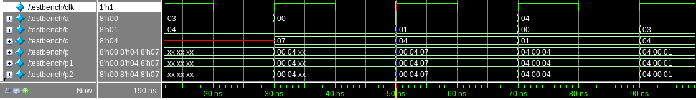
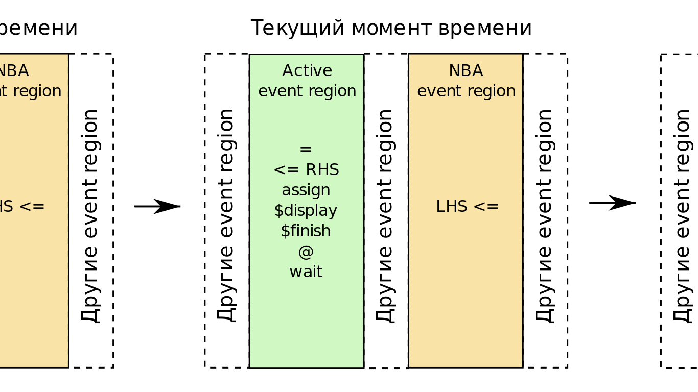
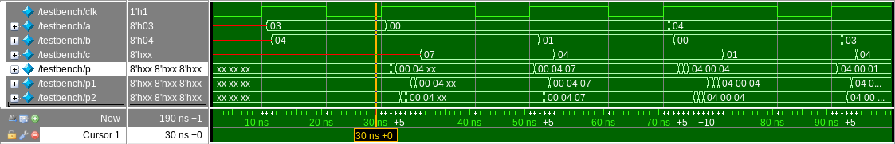
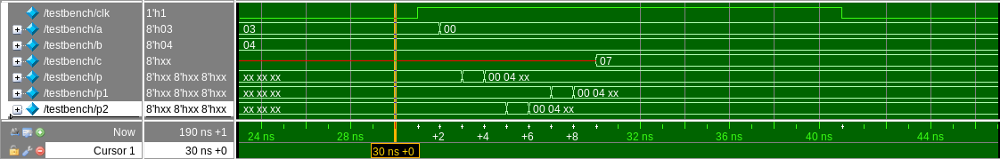
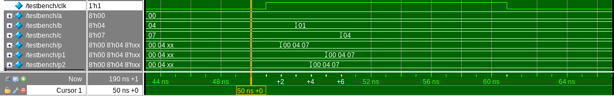
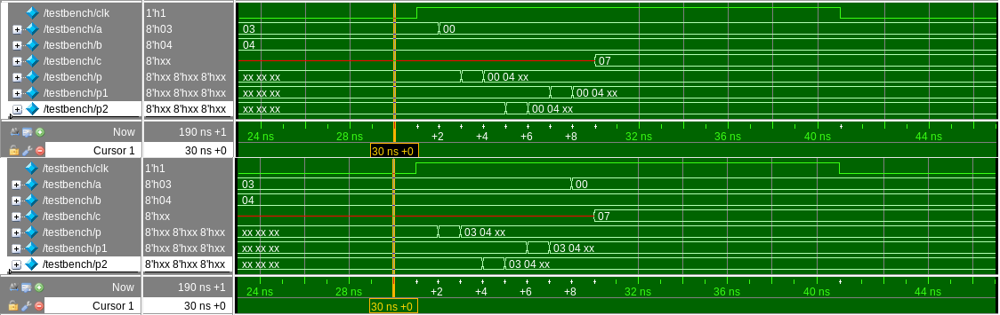
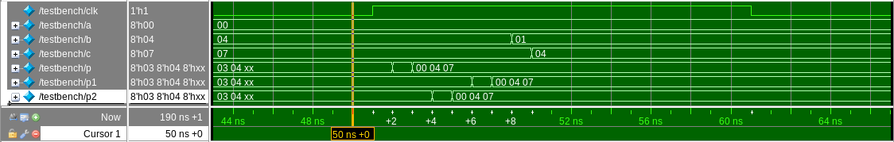

# Верификация на SystemVerilog. "Я же все правильно написал, почему не работает?" или "гонки" сигналов на симуляции.

## Вступление

Приветствую тебя, читатель!

Проверить 8-битный последовательностный сумматор. Казалось бы, что может быть проще? Но есть нюансы.

## Входные данные

Итак, имеем **дизайн**:

```verilog
module sum (
    input  logic       clk,
    input  logic [7:0] a,
    input  logic [7:0] b,
    output logic [7:0] c
);

    always_ff @( posedge clk) begin
        c <= a + b;
    end

endmodule
```

Напишем **простейшее верификационное окружение**.

## Пишем верификационное окружение

Создадим нужные сигналы и подключим модуль.

```verilog
logic       clk;
logic [7:0] a;
logic [7:0] b;
logic [7:0] c;

sum DUT (
    .clk(clk),
    .a  (a  ),
    .b  (b  ),
    .c  (c  )
);
```

Сгенерируем тактовый сигнал. `forever` - бесконечный цикл.

```verilog
initial begin
    clk <= 0;
    forever #10 clk <= ~clk;
end
```

Подадим входные воздействия. 10 раз (`repeat(10)`) значение в интервале от 0 до 5 (`$urandom_range(0,5)`).

```verilog
initial begin
    repeat(10) begin
        @(posedge clk);
        a = $urandom_range(0, 5);
        b = $urandom_range(0, 5);
    end
    $stop();
end
```

Реализуем логирование данных. Создаем `mailbox`, куда каждый такт отправляем данные с входных и выходных портов в виде структуры `packet`.

```verilog
typedef struct {
    logic [7:0] a;
    logic [7:0] b;
    logic [7:0] c;
} packet;

mailbox#(packet) mbx = new();
packet p;

initial begin
    forever begin
        @(posedge clk);
        p.a = a;
        p.b = b;
        p.c = c;
        mbx.put(p);
    end
end
```

Осталось циклически проводить проверку каждый такт. Забираем их `mailbox` пакеты и сравниваем, что результат текущего такта (`c`) равен сумме операндов прошлого такта (`a` и `b`).

```verilog
initial begin
    mbx.get(p1);
    forever begin
        mbx.get(p2);
        if( p2.c !== p1.a + p1.b ) begin
            $error("%t Real: %h, Expected: %h",
                $time(), p2.c, p1.a + p1.b);
        end
        p1 = p2;
    end
end
```

Полный код окружения размещен в файле [`testbench.sv`](./testbench.sv).

## Запускаем

**Симулятор**, используемый в примерах: **QuestaSim**.

Получается, все? Запускаем симуляцию!

```bash
cd src/
vlog *.sv
vsim -gui testbench -voptargs="+acc"
```

**Неожиданно сталкиваемся с ошибками.** Проблема в дизайне? Не думаю.

```
run -all
# ** Error:                   50 Real: 07, Expected: 04
#    Time: 50 ns  Scope: testbench File: testbench.sv Line: 55
# ** Error:                   90 Real: 01, Expected: 04
#    Time: 90 ns  Scope: testbench File: testbench.sv Line: 55
# ** Error:                  170 Real: 07, Expected: 03
#    Time: 170 ns  Scope: testbench File: testbench.sv Line: 55
# ** Note: $stop    : testbench.sv(26)
#    Time: 190 ns  Iteration: 1 Instance: /testbench
```

Смотрим временную диаграмму. Перемещаемся в момент времени 50ns, потому что согласно логу выше первая ошибка была обнаружена именно в этот момент времени.



Хм, кажется, все верно, `0x3` + `0x4` = `0x7`. Ошибка не наблюдается. В чем же проблема? И ведь тестбенч показывает, что результат должен быть 0x4. Как будто это уже результат для следующего такта.

**Проблема здесь кроется в блокирующих присваиваниях (=) вместо неблокируюищих (<=) в коде генерации входных воздействий**. Почему это важно? Следите за руками.

## SystemVerilog и регионы выполнения

Каждый уважающий себе верификатор знает, что **выполнение событий симуляции распределено по так называемым "регионам выполнения" или "регионам событий" (Event Region)**. Попадая в конкретный момент времени, симулятор обрабатывает события в некоторой последовательности, определенной стандартом SystemVerilog.

Обратим внимание на два региона: **Active** и **NBA**.

<p align="center">
</img>
</p>

Применительно к присваиваниям: все блокирующие (=) происходят в случайном порядке в регионе Active, все неблокирующие (<=) тоже в случайном порядке в NBA.

Когда я говорю "в случайном порядке", я имею в виду порядок относительно независимых процессов. То есть, если у вас есть два `initial`-блока, которые выполняются совместно:

```verilog
initial begin
    a = 10;
    a = 20;
end

initial begin
    b = 5
    b = 7;
end
```

То, присвоения внутри `begin-end` происходят последовательно, то есть после выполнения a будет таки равно 20, а b равно 7. Однако **симулятор может выполнять присвоения из этих двух блоков в любой последовательности**.

Например:

1. `a = 10;`
2. `b = 5;`
3. `b = 7;`
4. `a = 20;`

Или:

1. `b = 5;`
2. `a = 10;`
3. `a = 20;`
4. `b = 7;`

Подробный разбор регионов выполнения можно найти [тут](https://youtu.be/d5VjAqGpBvI?t=5383) и [тут](https://youtu.be/9lZ_fpcos6g?t=1586). Рекомендую посмотреть перед тем, как продолжим.

Также по этой теме рекомендую статью [SystemVerilog Event Regions, Race Avoidance & Guidelines от Clifford Cummings](http://www.sunburst-design.com/papers/CummingsSNUG2006Boston_SystemVerilog_Events.pdf).

Вооружившись знаниями, вернемся к симуляции.

## Посыпаем голову пеплом

Мы имеем интересную ситуацию. Совместно у нас исполняются `initial`-блоки генерации входных воздействий и мониторинга.

```verilog
initial begin
    repeat(10) begin
        @(posedge clk);
        a = $urandom_range(0, 5);
        b = $urandom_range(0, 5);
    end
    $stop();
end

...

initial begin
    forever begin
        @(posedge clk);
        p.a = a;
        p.b = b;
        p.c = c;
        mbx.put(p);
    end
end
```

Это означает, что в данном случае **после каждого фронта (`@(posedge clk)`) последовательность выполнения не определена.**

Она может быть такой (что нас устраивает):

1. `p.a = a;`
2. `p.b = b;`
3. `p.c = c;`
4. `mbx.put(p);`
5. `a = $urandom_range(0, 5);`
6. `b = $urandom_range(0, 5);`

А может быть и такой (что нас не устраивает):

1. `a = $urandom_range(0, 5);`
2. `b = $urandom_range(0, 5);`
3. `p.a = a;`
4. `p.b = b;`
5. `p.c = c;`
6. `mbx.put(p);`

Вернемся к моменту времени в 50ns.


А теперь переместимся в момент предыдущего такта (`30ns``) и **переключимся в режим Events Mode** _(правой кнопкой мыши по временной диаграмме -> Expanded Time -> Events Mode, затем снова правой кнопкой мыли по временной диаграмме -> Expanded Time -> Expand All)_.



Приблизим момент времени `30ns`.



Видим значения `30ns + 2 + 4 + ....` Это как раз таки очередность изменения сигналов в ходе одного региона выполнения времени `30ns`. А теперь внимательно посмотрите, какие данные сохраняются в пакет p. Верно, `0x0` и `0x4`. Почему? Потому что сначала выполнилось `a = $urandom_range(0,5)` (вернуло 0), а затем `p.a = a`. Получается, что вместо `0x3` и `0x4` в пакет попали `0x0` и `0x4`.

1. `a = $urandom_range(0, 5);`
2. `p.a = a;`
3. `p.b = b;`
4. `p.c = c;`
5. `mbx.put(p);`

Для `b = $urandom_range(0, 5)` точно сказать нельзя, потому что случайное число этого такта совпало с числом на предыдущем такте и наблюдать изменения мы не можем. Но в данном контексте это не важно.

А что происходит дальше? Передвигаемся в следующий такт и попадаем в момент `50ns`.



Здесь нам важно только сохранение результата. Обратите внимание, что сохранение результата `0x7` происходит до его обновления по фронту, т.к. значение c обновляется в коде сумматора через `<=`.

После получения пакета с результатом в этом же такте происходит происходит сравнение: `0x0` + `0x4` !== `0x7` (данные из пакета `p` "попадают" пакет `p2` сравниваются с данными из `p1`). Откуда `0x0` и `0x4` в `p1`? Так с предыдущего такта, где вместо `0x3` в пакет попало значение `0x0`.

**Явление, описанное выше, когда неопределенность последовательности выполнения событий симулятором приводит к неопределенному поведению симуляции, и называется "гонками сигналов" (англ. race condition).**

## Исправляем ошибки

Так, в чем проблема - разобрались. Остался вопрос: как её решить? На самом деле очень просто. Нужно помнить одно важное правило: **при взаимодействии с портами тестируемого последовательностного устройства используется неблокирующее присваивание (`<=`)**.

```verilog
initial begin
    repeat(10) begin
        @(posedge clk);
        a <= $urandom_range(0, 5);
        b <= $urandom_range(0, 5);
    end
    $stop();
end
```

Как это поможет? Так ведь значения, присвоение которым происходит через неблокирующее присваивание (`<=`), в обязательном порядке выполняются после выполнения всех блокирующих (вспомните раздел SystemVerilog и регионы выполнения). Для нас это значит, что `a <= $urandom_range(0 ,5)` и `b <= $urandom_range(0, 5)` выполнятся после сохранения информации о входных значениях, выставленных на предыдущем такте.

Сохраняем изменения и запускаем симуляцию. Ошибки пропали.

```
run -all
# ** Note: $stop    : testbench.sv(26)
#    Time: 190 ns  Iteration: 1 Instance: /testbench
```

Код исправленного окружения размещен в файле [`testbench.sv`](./testbench.sv).

Давайте сравним время `30ns` для ошибочного и справленного модулей тестирования. Сверху ошибочный модуль, снизу - исправленный.



Видим, что в исправленном окружении значение `0x0` подается на вход `a` после сохранения информации о значениях на входах в текущий момент времени. Происходит это потому, что выставление значения на вход делается через неблокирующее присваивание (`<=`), а считывание значений через блокирующее.

Здесь мы сами для себя дополнили озвученное выше правило, звучать оно теперь будет так:

**При тестировании последовательностного устройства входные воздействия следует подавать через неблокирующие (`<=`) присваивания, а считывать выходные и проверять их - через блокирующие (`=`).**

Таким образом, в моменте времени `30ns` получаем пакет с верными данными `0x3` и `0x4`. Далее, в моменте времени `50ns` (на следующем такте) получаем данные с выхода.



После получения пакета с результатом в этом же такте происходит происходит сравнение: `0x3` + `0x4` !== `0x7` (данные из пакета `p` "попадают" пакет `p2` сравниваются с данными из `p1`). Откуда `0x3` и `0x4` в `p1`? Так с предыдущего такта, где они были сохранены в процессе мониторинга.

## Заключение

Что ж, читатель, мы с тобой детально разобрали такое непростое, но одновременно интересное явление, как "гонки сигналов" на симуляции. В ходе разбора вывели правило, которое обезопасит меня, тебя и еще множество инженеров от потраченного на поиск ошибки времени и нервов.

А больше подобных заметок ты можешь найти в Telegram-канале автора [Verification For All](https://t.me/verif_for_all).

Хорошего тебе дня и до новых встреч! 
