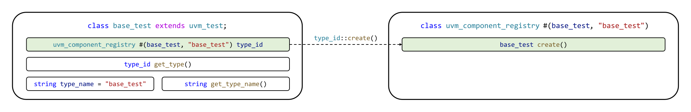
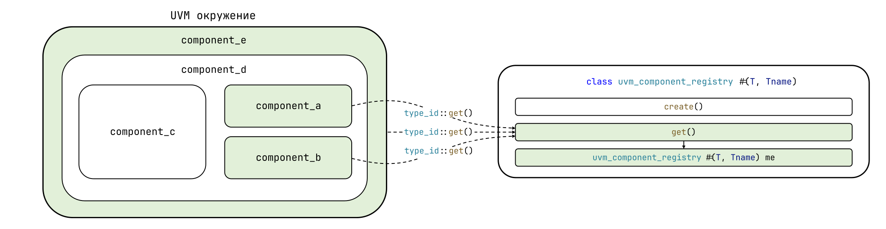
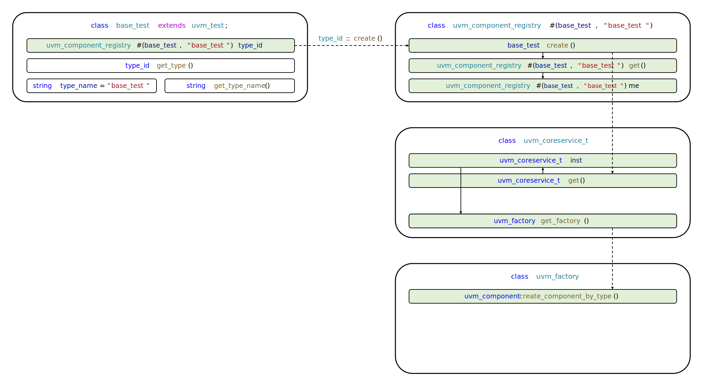
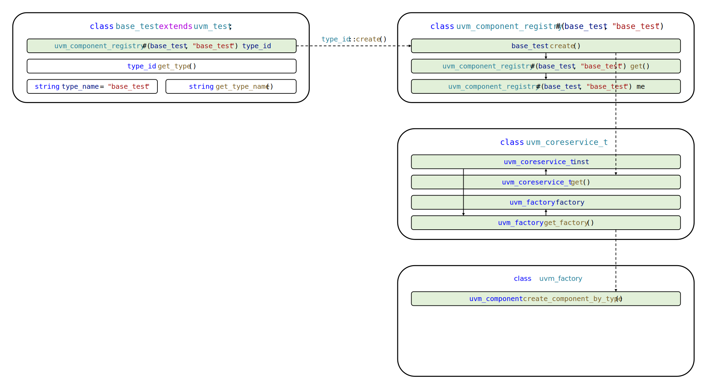

# Demystifying UVM: Фабрика, часть 1

- [Demystifying UVM: Фабрика, часть 1](#demystifying-uvm-фабрика-часть-1)
  - [Вступление](#вступление)
    - [Цикл статей Demystifying UVM](#цикл-статей-demystifying-uvm)
    - [Motivation или зачем это всё](#motivation-или-зачем-это-всё)
    - [Необходимые знания](#необходимые-знания)
  - [От автора про UVM](#от-автора-про-uvm)
    - [Версионирование](#версионирование)
    - [Сложность изучения](#сложность-изучения)
    - [Подход автора к изучению](#подход-автора-к-изучению)
  - [SystemVerilog и параметризация классов типами](#systemverilog-и-параметризация-классов-типами)
  - [Создание компонентов в UVM](#создание-компонентов-в-uvm)
    - [Case study](#case-study)
    - [Макросы регистрации](#макросы-регистрации)
    - [Proxy-класс регистрации](#proxy-класс-регистрации)
  - [Класс сервисов UVM](#класс-сервисов-uvm)
  - [To be continued...](#to-be-continued)


## Вступление

### Цикл статей Demystifying UVM

Доброго времени суток, дорогие читатели! Данная статья является первой (нулевой) в целом цикле, который называется **Demystifying UVM**. Цикл будет посвящен глубокому погружению в основные концепции и механизмы работы библиотеки универсальной методологии верификации (Universal Verification Methodology, UVM).

### Motivation или зачем это всё

Как часто начинающий верификатор начинает использовать UVM, совершенно не понимая, **что вообще происходит**. Что такое `uvm_component_utils` и `type_id::create()`? Почему у конструктора объекта один аргумент, а у конструктора компонента два? Откуда вдруг "взялась" функция `get_full_name()`? Как создаются иерерхические имена по типу `uvm_test_top.env.ag.mon`? И что это вообще за `uvm_test_top`?! **Очень много вопросов и очень мало общедоступных ответов.**

Автор поставил перед собой задачу рассеять туман над исходным кодом UVM и основными концепциями, используемыми в данной библиотеке.

### Необходимые знания

Стоит заметить, что цикл Demystifying UVM **не рассчитан на инженера с околонулевыми знаниями**.

Для освоения материала читателю необходимо знать:
- принципы ООП в SystemVerilog;
- очереди (`queue`, `[$]`);
- ключевые слова `local`, `protected`, `virtual`;
- upcasting классов в SystemVerilog;
- downcasting классов в SystemVerilog;
- статические методы классов в SystemVerilog;
- параметризацию классов в SystemVerilog.

Для получения перечисленных выше знаний рекомендуется ознакомиться с лекцией автора в Школе синтеза цифровых схем: [ООП в функциональной верификации. Транзакционная модель тестирования](https://youtu.be/HRqS_vmi45w?t=1955).

## От автора про UVM

### Версионирование

Библиотека UVM впервые была официально представлена в феврале 2011 года и со временем претерпевала изменения в различных версиях. Полный список версий и их исходный код представлен в [соответствующем разделе на сайте компании Accellera](https://www.accellera.org/downloads/standards/uvm).

**В цикле статей Demystifying UVM для анализа будет использован исходный код UVM 1.2.** Основной причиной является то, что, хоть версия 1.2 и была выпущена в далеком 2014 году, она по сей день является самой часто используемой и поддерживается всеми коммерческими симуляторами (в данном контексте "поддерживается" — предоставляется в уже скомпилированном виде)[^1]. Стоит также заметить, что основные концепции, которые будут рассматриваться в циклей статей Demystifying UVM, были представлены уже в самой первой версии (1.0) и не претерпели практически никаких изменений вплоть до самой актуальной на момент написания статьи версии 2020-3.1.

### Сложность изучения

В ходе изучения UVM **основными сложностями** для инженера являются:
- высокий порог входа;
- внушительная и сложновоспринимаемая кодовая база;
- сравнительно небольшое количество профильной литературы.

Перед освоением UVM инженеру необходимо изучить множество конструкций SystemVerilog, а также принципы ООП и их реализацию. И, даже освоив вышеперечисленное, инженер столкнется с кодовой базовой из более 30000 строк кода, которая к тому же не всегда задокументирована.

Также стоит заметить, что хоть библиотека UVM и предоставляет действительно широкий спектр возможностей для верификации, в реальности используется лишь их небольшая часть со специфичными для конкретного проекта "вставками" функционала библиотеки.

Отдельным камнем преткновения является небольшое количество профильной литературы по UVM, в особенности той, в которой бы детально описывались основные концепции и механизмы работы. Известная UVM Cookbook по своей сути является сборником советов и шаблонов, что, тем не менее, нисколько не умаляет иных достоинств данной книги.

### Подход автора к изучению

> Сочинять не так уж трудно; зачеркивать лишние ноты – вот что труднее всего.
> 
> Иоганнес Брамс

Автор искренне убежден, что для разбора не самых простых концепций, прежде всего, необходимо отбросить все лишнее. И в исходном коде UVM "лишнего" действительно достаточно. Важно заметить, что под "лишним" в данном контексте подразумевается код, который никак не влияет на разбираемый функционал и который можно исключить в угоду удобству изучения.

Обращу ваше внимание, что под "исключить" имеется в виду буквальное исключение. В цикле Demystifying UVM **будет анализироваться авторская версия библиотеки UVM**, в которой  сохранен лишь код, непосредственно отвечающий за разбираемый функционал. Это позволит начинающим инженерам сфокусироваться на конкретных концепциях, а после, при желании, изучить оригинальные исходные файлы UVM.

Насколько хороша описанная выше задумка, дорогие читатели, — покажет ~~время~~ ваша обратная связь. А теперь — к делу!

## SystemVerilog и параметризация классов типами

Перед погружением в исходный код UVM необходимо вспомнить одну из особенностей SystemVerilog. А именно — **возможность параметризации класса типом**. Пример параметризованного таким образом класса представлен в файле `src/test/test_pkg.sv`.

```verilog
class my_wrapper #(type T);
    
    static function T create_some_class();
        T cl = new();
        return cl;
    endfunction

endclass
```

Класс `my_wrapper` параметризован типом `T` и содержит статический метод `create_some_class()`, функицоналом которого является создание объекта типа `T` при помощи `T cl = new()` и возвращение указателя на него при помощи `return cl`.

Также в файле объявлены два класса для демонстрации параметризации типом:

```verilog
class my_awesome_class;

    virtual function void print();
        $display("Hello from 'my_awesome_class'!");
    endfunction

endclass

class my_new_awesome_class extends my_awesome_class;

    virtual function void print();
        $display("Hello from 'my_new_awesome_class'!");
    endfunction

endclass
```

Обратите внимание, что так же, как и с "классическими" параметрами, `my_wrapper#(my_awesome_class)` и `my_wrapper#(my_new_awesome_class)` являются разными типами. Пример использования параметризованного класса представлен в файле `src/test/tb_simple.sv`.

```verilog
initial begin

    my_awesome_class cl;

    cl = my_wrapper#(my_awesome_class)::create_some_class();
    cl.print();

    cl = my_wrapper#(my_new_awesome_class)::create_some_class();
    cl.print();

end
```

В данном примере при помощи статического метода `create_some_class()` создается сначала объект типа `my_awesome_class`, а затем типа `my_new_awesome_class`. Handle `cl` будет указывать на объект типа `my_awesome_class`, а далее на объект типа `my_new_awesome_class`. При вызове метода `print()` сначала будет вызвана реализация класса `my_awesome_class`, а затем класса `my_new_awesome_class`, т.к. метод является виртуальным. Результат выполнения представлен ниже.

```
# Hello from 'my_awesome_class'!
# Hello from 'my_new_awesome_class'!
```

Для запуска примера при помощи QuestaSim или Verilator в директории `src` необходимо выполнить скрипты `run_questa.sh` и `run_verilator.sh` соответственно (с аргументом `tb_simple`):

```bash
run_questa.sh tb_simple
```

```bash
run_verilator.sh tb_simple
```

## Создание компонентов в UVM

### Case study

Типовое создание компонента в UVM выглядит следующим образом:

```verilog
monitor = apb_monitor::type_id::create("mon", this);
```

У каждого начинающего (и не только) верификатора строка выше вызовет вопрос: **что такое `type_id::create()`**? В абсолютном большинстве литературы инженер увидит лишь упоминание о том, что вызов `type_id::create()` является альтерантивой вызову `new()`, и он должен использоваться для создания компонентов верификационного окружения.

Почему для создания компонентов необходимо использовать `type_id::create()` и какие возможности предоставляет данный подход — рассмотрим далее!

### Макросы регистрации

Предварительно изучив необходимую теорию и таким образом размявшись, начинаем наше погружение. При объявлении компонента UVM необходимо использовать макрос `uvm_component_utils`, который, как указано в большинстве источников, отвечает за **регистрацию типа**. Пример использования представлен ниже.

```verilog
class base_test extends uvm_component;

    `uvm_component_utils(base_test)

    function new(string name, uvm_component parent);
        super.new(name, parent);
    endfunction

    ...

endclass
```

Что такое **регистрация типа** и что же кроется за представленным макросом? Рассмотрим исходный код файла, в котором определен `uvm_component_utils`. Для этого откроем файл `src/uvm/uvm_object_defines.svh`:

```verilog
`define uvm_component_utils(T) \
   `m_uvm_component_registry_internal(T,T) \
   `m_uvm_get_type_name_func(T) \
```

Видим, что макрос `uvm_component_utils(T)` параметризован переменной `T` и "раскрывается" в два других макроса: `m_uvm_component_registry_internal(T,T)` и `m_uvm_get_type_name_func(T)`. Их исходный код приведен ниже.

```verilog
`define m_uvm_component_registry_internal(T,S) \
   typedef uvm_component_registry #(T,`"S`") type_id; \
   static function type_id get_type(); \
      return type_id::get(); \
   endfunction

`define m_uvm_get_type_name_func(T) \
   const static string type_name = `"T`"; \
   virtual function string get_type_name (); \
      return type_name; \
   endfunction
```

Давайте раскроем макрос в примере выше:

```verilog
class base_test extends uvm_component;

    typedef uvm_component_registry #(base_test, "base_test") type_id;
    static function type_id get_type();
       return type_id::get();
    endfunction

    const static string type_name = "base_test";
    virtual function string get_type_name();
       return type_name;
    endfunction

    function new(string name, uvm_component parent);
        super.new(name, parent);
    endfunction

    ...

endclass
```

Если анализировать код снизу вверх, то макрос `uvm_component_utils` отвечает за создание в теле класса статического поля `type_name`, которое содержит название типа класса в виде строки, а также метод `get_type_name()`, возвращающий это название типа.

Также макрос определяет внутри класса тип `type_id`, который является алиасом для типа `uvm_component_registry #(base_test, "base_test")` и статический метод `get_type()`, который вызывает статический метод `get()` типа `type_id`.

**Так что же значит `type_id::create()`?** На самом деле это ничего более, чем вызов статического метода типа `type_id`, который является алиасом для класса регистрации  `uvm_component_registry`, параметризованного типом класса `T`, который мы хотим зарегистрировать (в примере выше `T = base_test`).

Внимательно прочитайте предыдущее предложение и постарайтесь его осознать. Постарайтесь объяснить, почему для класса типа `base_test` вызов `type_id::create()` эквивалентен вызову `uvm_component_registry#(base_test, "base_test")::create()`.

Визуализация вызова `type_id::create()` представлена на изображении ниже.



Но что же все таки значит "зарегистрировать" тип, и что такое класс регистрации? Давайте обсудим!

### Proxy-класс регистрации

Рассмотрим исходный код файла, в котором определен тип `uvm_component_registry`. Для этого откроем файл `src/uvm/uvm_registry.svh`:

```verilog
class uvm_component_registry #(
    type   T     = uvm_component,
    string Tname = "<unknown>"
) extends uvm_object_wrapper;

    ...
    
    local static this_type me = get();

    static function this_type get();
        if (me == null) begin
            me = new();
        end
        return me;
    endfunction

    ...

endclass
```

Класс типа `uvm_component_registry` является proxy-классом для типа, которым он параметризован (`T`). По своей сути **proxy-класс является своеобразным хранилищем информации о типе**. Также proxy-класс предоставляет API для создания объектов этого типа.

Заметим, что proxy-класс наследуется от класса `uvm_object_wrapper`. Данный класс не представляет особого интереса и является непараметризованным классом, через handle которого можно передавать указатель на параметризованные `uvm_component_registry`. 

Вернемся к объявлению класса `uvm_component_registry`. Важно заметить, что класс является **singleton-классом[^2]**. Особенность singleton'а заключается в том, что объект такого типа в ходе симуляции существует в единственном экземпляре и создается при первом обращении к нему при помощи специализированного статического метода. Название такого метода может быть любым, но часто можно встретить такие наименования, как `get()` или `get_inst()`.

Давайте разберем чуть подробнее тело класса выше. Статическая переменная `me` является защищенным указателем на единственный экземпляр singleton-класса. Метод `get()` является методом доступа к этому защищенному указателю. Обратите внимание, что указатель инициализируется единственный раз в том случае, если он равен `null` (не указывает ни на какой объект в памяти).

Концептуально использование singleton-класса представлено на изображении ниже.



Каждый компонент (в примере это `component_a`, `component_b` и `component_e`, они выделены зеленым цветом) при обращении к singleton-классу `uvm_component_registry` ,будет получать указатель единственный экземпляр этого класса. Указатель будет храниться в защищенном поле `me`.

Проанализируем другую часть тела класса регистрации:

```verilog
class uvm_component_registry #(
    type   T     = uvm_component,
    string Tname = "<unknown>"
) extends uvm_object_wrapper;

    ...
    
    virtual function uvm_component create_component(
        string        name,
        uvm_component parent
    );
        T obj;
        obj = new(name, parent);
        return obj;
    endfunction

    ...

endclass
```

Метод `create_component()` возвращает объект типа `T` (или объект типа, наследуемого от `T`). Именно в этом методе мы можем увидеть непосредстевенно вызов конструктора `new()`. То есть именно в данном методе создается объект запрашиваемого типа `T`. Это значит, что вызов **`type_id::create()` приводит к вызову `create_component()` proxy-класса типа `type_id`**, ведь `type_id` — это просто алиас для proxy-класса, параметризованного типом `T`. Но где вызывается этот метод? Скоро узнаем!

Проанализируем другую часть тела класса регистрации:

```verilog
class uvm_component_registry #(
    type   T     = uvm_component,
    string Tname = "<unknown>"
) extends uvm_object_wrapper;

    ...
    
    static function T create(
        string        name,
        uvm_component parent
    );
        uvm_component obj;
        uvm_coreservice_t cs = uvm_coreservice_t::get();
        uvm_factory factory = cs.get_factory();
        obj = factory.create_component_by_type(get(), name, parent);
        $cast(create, obj);
    endfunction

    ...

endclass
```

Вот мы и добрались до метода `create()`! Именно этот статический метод вызывается при помощи `type_id::create()`. Погрузимся еще глубже. В данном методе нас интересуют строки:

```verilog
uvm_coreservice_t cs = uvm_coreservice_t::get();
uvm_factory factory = cs.get_factory();
obj = factory.create_component_by_type(get(), name, parent);
```

В первой строке реализуется доступ к singleton-классу типа `uvm_coreservice_t`. Данный класс предоставляет API для создания объектов, настроек логирования и т.д., его реализация будет рассмотрена чуть позже. Во второй строке при помощи указателя на класс сервисов производится получение доступа к указателю на класс фабрики UVM (`uvm_factory`) при помощи `cs.get_factory()`. И, наконец, в 3 строке производится создание объекта при помощи `create_component_by_type()`.

Можно сделать вывод, что вызов `type_id::create()` приводит к вызову метода `create_component_by_type()` класса фабрики UVM (`uvm_factory`). Доступ же к классу фабрики производится через класс сервисов UVM (`uvm_coreservice_t`). Также теперь становится очевидно, что каждый вызов `type_id::create()` приводит к получению указателя на единственный экземпляр proxy-класса при помощи `get()`.

Дополненная визуализация вызова `type_id::create()` представлена на изображении ниже.



Какова реализация класса фабрики и класса сервисов в UVM? Давайте обсудим это в разделах ниже!

## Класс сервисов UVM

Рассмотрим исходный код файла, в котором определен тип `uvm_coreservice_t`.  Для этого откроем файл `src/uvm/uvm_coreservice.svh`:

```verilog
class uvm_coreservice_t;

	local static uvm_coreservice_t inst;

	static function uvm_coreservice_t get();
		if(inst == null) begin
			inst = new();
        end
		return inst;
	endfunction

    local uvm_factory factory;

    virtual function uvm_factory get_factory();
	    if(factory == null) begin
	    	factory = new();
	    end 
		return factory;
	endfunction

endclass
```

Уже вооружившись знаниями о singleton-классах делаем вывод о том, что данный класс также является singleton. Доступ к единственному экземпляру осуществляется при помощи статического метода `get()`. Обратим внимание, что класс содержит указатель на класс фабрики UVM в защищенном поле `factory`. Доступ этому указателю осуществляется при помощи метода `get_factory()`. Стоит заметить, что **в оригинальной версии (не авторской) класс сервисов содержит больше функционала**, однако в рамках данной статьи дополнительный код осложнил бы восприятие.

Дополненная визуализация вызова `type_id::create()` представлена на изображении ниже.



## To be continued...

Вот и подошла к своему логическому завершению первая статья цикла Demystifying UVM. В ней вы узнали, что классы в SystemVerilog можно параметризовывать типами, и запустили простейший пример. Узнали, что кроется за макросом `uvm_component_utils` и что такое proxy-класс регистрации. Освоили концепцию singleton-класса и проанализировали минимальную авторскую реализацию класса сервисов UVM.

**В конце данной статьи мы вплотную приблизились к реализации класса фабрики UVM**. Она будет подробно разобрана в следующей статье, ссылка на которую в скором будет опубликована в Telegram-канале автора [Verification For All (VFA)](https://t.me/verif_for_all). Вас ждет подробный разбор механизмов создания компонентов UVM и переопределения их типов, а также множество примеров.

Всего вам наилучшего, дорогие читатели! Мира и процветания!☀️

[^1]: Siemens QuestaSim, Cadence Xcelium, Synopsys VCS. Что интересно: UVM 1.2 единственная версия UVM, которая [поддерживается встроенным симулятором Xilinx Vivado](https://adaptivesupport.amd.com/s/question/0D52E00006iHj9gSAC/difference-between-standard-uvm-12-and-xlnxuvmpkg?language=en_US).
[^2]: [Ссылка](https://dvtalk.me/2021/09/03/singleton-class-in-systemverilog/) на отличную статью о singleton-классах в SystemVerilog.
