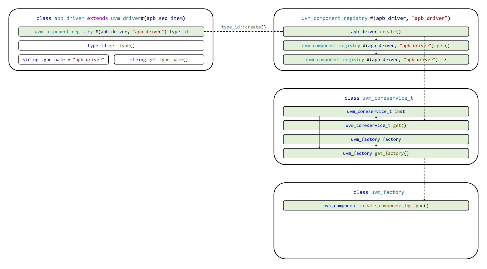
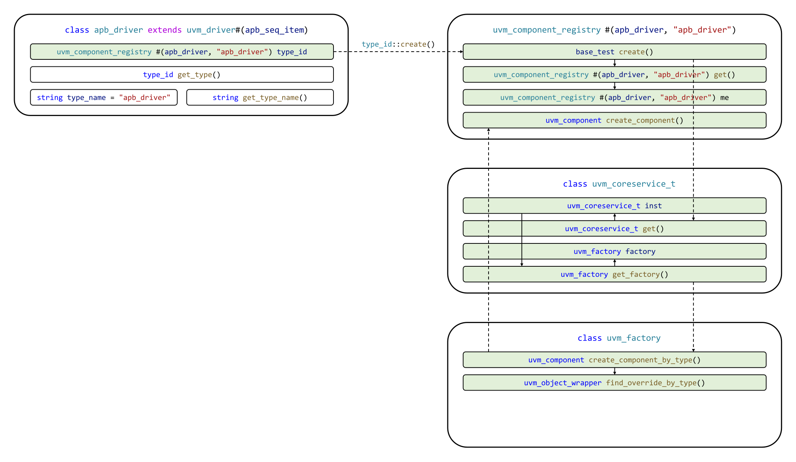
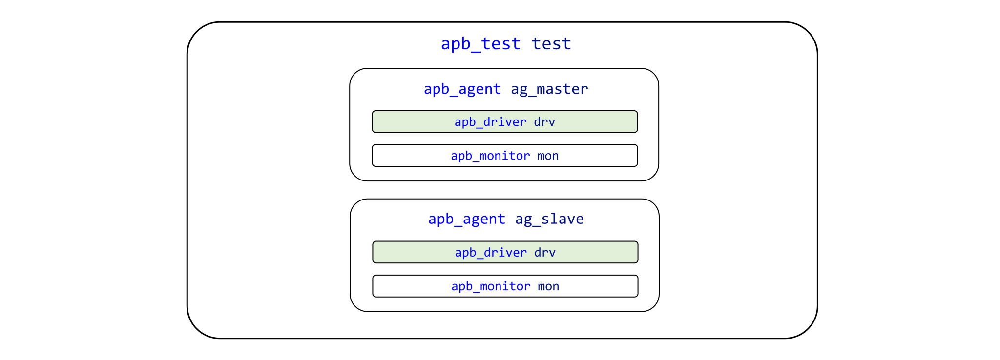
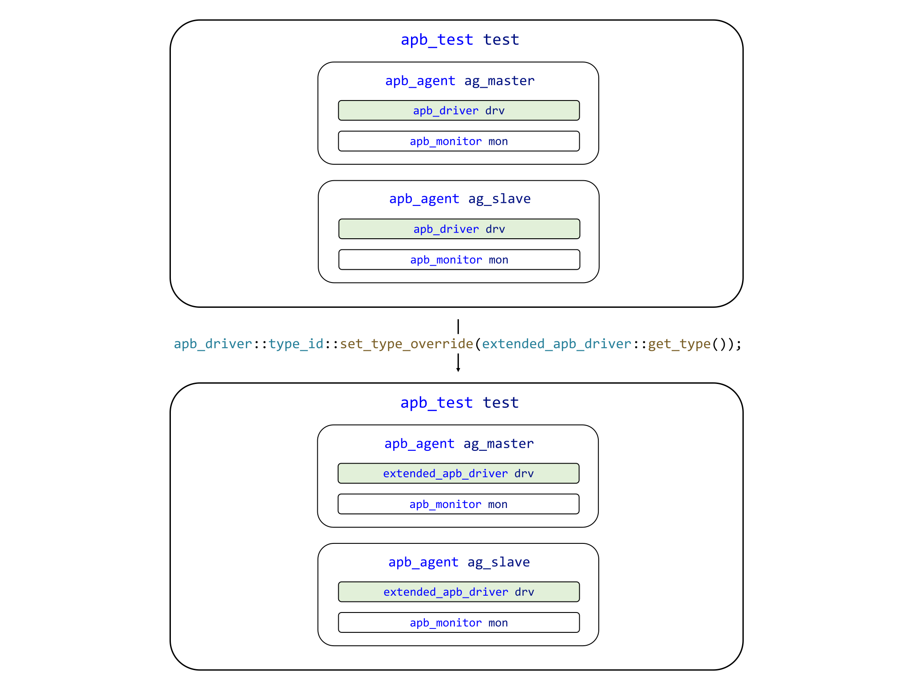
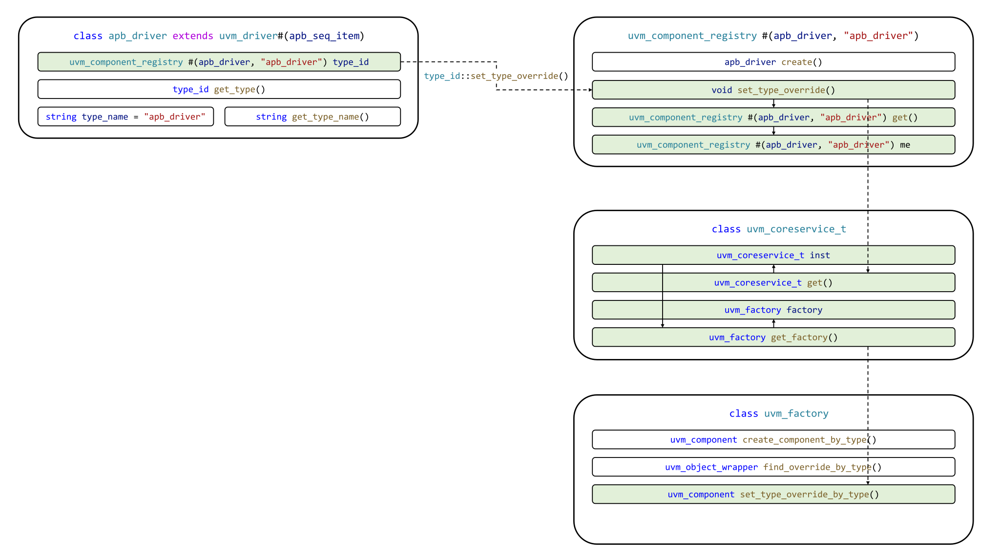
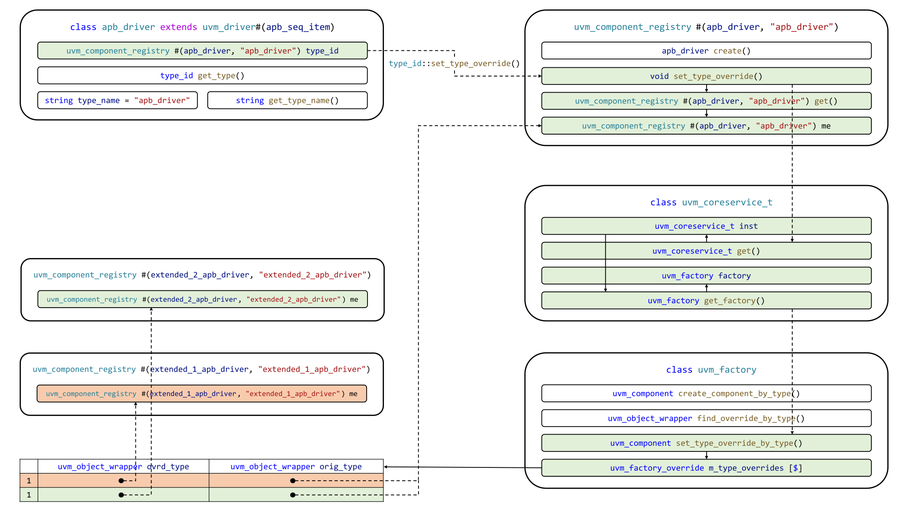
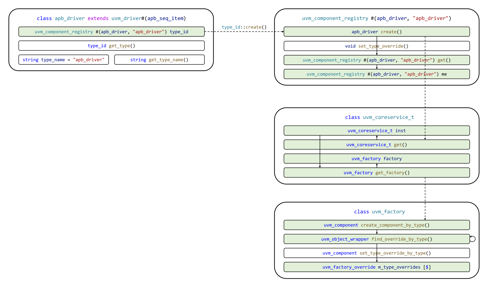
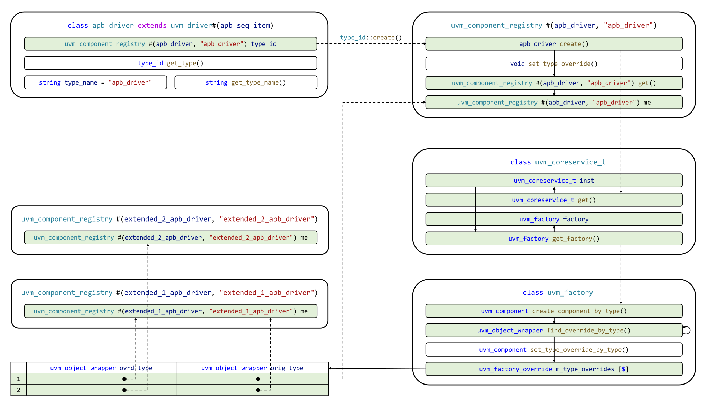

# Demystifying UVM: Фабрика, часть 2

- [Demystifying UVM: Фабрика, часть 2](#demystifying-uvm-фабрика-часть-2)
  - [Вступление](#вступление)
    - [Цикл статей Demystifying UVM](#цикл-статей-demystifying-uvm)
    - [Motivation или зачем это всё](#motivation-или-зачем-это-всё)
    - [Необходимые знания](#необходимые-знания)
  - [Подсвечивание](#подсвечивание)
    - [Первая часть статьи](#первая-часть-статьи)
    - [Маршрут создания компонента UVM](#маршрут-создания-компонента-uvm)
  - [Класс фабрики UVM](#класс-фабрики-uvm)
    - [Первое касание](#первое-касание)
    - [Переопределение типов](#переопределение-типов)
    - [Создание компонентов](#создание-компонентов)
  - [Playground](#playground)
  - [To be continued...](#to-be-continued)

## Вступление

### Цикл статей Demystifying UVM

Доброго времени суток, дорогие читатели! Данная статья является второй в целом цикле, который называется **Demystifying UVM**. Цикл будет посвящен глубокому погружению в основные концепции и механизмы работы библиотеки универсальной методологии верификации (Universal Verification Methodology, UVM).

### Motivation или зачем это всё

Как часто начинающий верификатор начинает использовать UVM, совершенно не понимая, **что вообще происходит**. Что такое `uvm_component_utils` и `type_id::create()`? Почему у конструктора объекта один аргумент, а у конструктора компонента два? Откуда вдруг "взялась" функция `get_full_name()`? Как создаются иерерхические имена по типу `uvm_test_top.env.ag.mon`? И что это вообще за `uvm_test_top`?! **Очень много вопросов и очень мало общедоступных ответов.**

Автор поставил перед собой задачу рассеять туман над исходным кодом UVM и основными концепциями, используемыми в данной библиотеке.

### Необходимые знания

Стоит заметить, что цикл Demystifying UVM **не рассчитан на инженера с околонулевыми знаниями**.

Для освоения материала читателю необходимо знать:
- принципы ООП в SystemVerilog;
- очереди (`queue`, `[$]`);
- ключевые слова `local`, `protected`, `virtual`;
- upcasting классов в SystemVerilog;
- downcasting классов в SystemVerilog;
- статические методы классов в SystemVerilog;
- параметризацию классов в SystemVerilog.

Для получения перечисленных выше знаний рекомендуется ознакомиться с лекцией автора в Школе синтеза цифровых схем: [ООП в функциональной верификации. Транзакционная модель тестирования](https://youtu.be/HRqS_vmi45w?t=1955).

## Подсвечивание

Автор убежден, что прежде чем приступить к изучению нового материала, необходимо повторить ранее изученный, который связан с новым. Автор называет этот подход **подсвечиванием**. По образу и подобию того, как при грозе в темном небе вспыхивают молнии, в разуме человека при повторении уже изученного материала возникают "вспышки", подсвечивающие ключевые аспекты. Озаренная вспышками часть материала далее успешно служит фундаментом для освоения нового.

### Первая часть статьи

Автор настоятельно рекомендует ознакомиться с первой частью статьи: [Demystifying UVM: Фабрика, часть 1](https://serge0699.github.io/vfa/articles/uvm_factory_0/). В ней была рассмотрена теория о [параметризации классов типами в SystemVerilog](https://serge0699.github.io/vfa/articles/uvm_factory_0/#systemverilog-%D0%B8-%D0%BF%D0%B0%D1%80%D0%B0%D0%BC%D0%B5%D1%82%D1%80%D0%B8%D0%B7%D0%B0%D1%86%D0%B8%D1%8F-%D0%BA%D0%BB%D0%B0%D1%81%D1%81%D0%BE%D0%B2-%D1%82%D0%B8%D0%BF%D0%B0%D0%BC%D0%B8). Был проанализирован макрос `uvm_component_utils` и освоены важнейшие концепции [singleton-класса](https://serge0699.github.io/vfa/articles/uvm_factory_0/#2) и [proxy-класса регистрации типа](https://serge0699.github.io/vfa/articles/uvm_factory_0/#proxy-%D0%BA%D0%BB%D0%B0%D1%81%D1%81-%D1%80%D0%B5%D0%B3%D0%B8%D1%81%D1%82%D1%80%D0%B0%D1%86%D0%B8%D0%B8). Также была проанализирована [минимальная авторская реализация класса сервисов UVM](https://serge0699.github.io/vfa/articles/uvm_factory_0/#%D0%9A%D0%BB%D0%B0%D1%81%D1%81-%D1%81%D0%B5%D1%80%D0%B2%D0%B8%D1%81%D0%BE%D0%B2-uvm).

### Маршрут создания компонента UVM

Вспомним, что в [первой части статьи](https://serge0699.github.io/vfa/articles/uvm_factory_0/) был частично определен маршрут создания компонента UVM (то есть любого класса, который наследуется от `uvm_component` или наследника `uvm_component` любого уровня) при помощи `type_id::create()`.

Визуализация вызова `type_id::create()` для некоторого класса драйвера интерфейса AMBA APB[^1] `apb_driver` представлена на изображении ниже.



Создание компонента начинается с вызова `type_id::create()`, где `type_id` — алиас для класса регистрации  `uvm_component_registry`, параметризованного типом класса `T`.

Еще раз рассмотрим реализацию метода `type_id::create()`. Для этого откроем файл [`src/uvm/uvm_registry.svh`](https://github.com/serge0699/vfa/blob/master/articles/uvm_factory_1/src/uvm/uvm_registry.svh):

```verilog
class uvm_component_registry #(
    type   T     = uvm_component,
    string Tname = "<unknown>"
) extends uvm_object_wrapper;

    ...
    
    static function T create(
        string        name,
        uvm_component parent
    );
        uvm_component obj;
        uvm_coreservice_t cs = uvm_coreservice_t::get();
        uvm_factory factory = cs.get_factory();
        obj = factory.create_component_by_type(get(), name, parent);
        $cast(create, obj);
    endfunction

    ...

endclass
```

Вызов `type_id::create()` инициирует получение указателя на объект класса сервисов UVM, который, в свою очередь, содержит указатель на объект фабрики UVM. Через указатель вызывается метод фабрики UVM `create_component_by_type()`, который возвращает указатель на объект запрашиваемого типа. **Запрашиваемый тип — это тип, которым параметризован proxy-класс `type_id` для которого вызывается метод `create()`**. Но только ли указатель на объект запрашиваемого типа может быть возвращен фабрикой? Узнаем уже совсем скоро!

## Класс фабрики UVM

### Первое касание

Рассмотрим исходный код файла, в котором определен тип `uvm_factory`. Для этого откроем файл [`src/uvm/uvm_factory.svh`](https://github.com/serge0699/vfa/blob/master/articles/uvm_factory_1/src/uvm/uvm_factory.svh):

```verilog
class uvm_factory;

    ...

    virtual function uvm_component create_component_by_type(
        uvm_object_wrapper requested_type,  
        string             name, 
        uvm_component      parent
    );

        requested_type = find_override_by_type(requested_type);
        return requested_type.create_component(name, parent);

    endfunction

    ...

endclass
```

Рассмотрим реализацию метода `create_component_by_type()`. При вызове `type_id::create()` вызывается именно этот метод, а в него в качестве одного из аргументов передается указатель на proxy-класс запрашиваемого типа. Заметим, что `create_component_by_type()` возвращает указатель на объект через handle типа `uvm_component`. Это значит, что данный метод фабрики UVM может вернуть указатель на любого наследника `uvm_component`.

Реализация метода `create_component_by_type()` представляет собой:
1. Поиск возможных переопределений запрашиваемого типа через `find_override_by_type()`;
2. Создание объекта результирующего типа через `create_component()` и возвращение указателя на этот объект.

Дополненная визуализация вызова `type_id::create()` для класса `apb_driver`  представлена на изображении ниже.



Важно более **подробно остановиться на термине "результирующий тип"**. Дело в том, что в ходе создания компонентов верификационного окружения часто используется переопределение типов. Метод `find_override_by_type()` используется для поиска возможных переопределений. **Результатом вызова (то есть результирующим типом) этого метода может быть как указатель на proxy-класс запрашиваемого типа, так и proxy-класс типа, на который запрашиваемый тип был переопределен.** Звучит достаточно расплывчато, не так ли? Прежде чем разбирать реализацию `find_override_by_type()`, следует более подробно ознакомиться с механизмами переопределения типов в UVM. Сделаем это!

### Переопределение типов

Типовое переопределение компонента в UVM выглядит следующим образом:

```verilog
apb_driver::type_id::set_type_override(extended_apb_driver::get_type());
```

Строка кода выше при помощи метода `set_type_override()` переопределяет тип `apb_driver` на тип `extended_apb_driver`. **Под "переопредением" в данном контексте подразумеваются действия, которые приводят к тому, что любой запрос на создание компонента типа `apb_driver` через `type_id::create()` приведет к созданию компонента типа `extended_apb_driver`**. Это значит, что все компоненты, созданные при помощи `apb_driver::type_id::create()`, будут иметь тип `extended_apb_driver`.

Рассмотрим простейший пример. Разберем верификационное UVM-окружение, структурная схема которого представлена на изображении ниже.



Окружение состоит из класса теста типа `apb_test`, в котором содержится два агента типа `apb_agent`, в каждом из которых содержится драйвер типа `apb_driver` и монитор типа `apb_monitor`.

Возможный вариант объявления класса `apb_test` представлен ниже:

```verilog
class apb_test extends uvm_test;

    `uvm_component_utils(apb_test)

    apb_agent ag_master;
    apb_agent ag_slave;

    function new(string name, uvm_component parent);
        super.new(name, parent);
    endfunction

    virtual function void build_phase(uvm_phase phase);
        ag_master = apb_agent::type_id::create("ag_master", this);
        ag_slave  = apb_agent::type_id::create("ag_slave",  this);
    endfunction

endclass
```

А теперь предположим, что уже в процессе верификации спецификация на дизайн изменилась, и был добавлен дополнительный функционал. Для взаимодействия с новой версией был разработан новый класс драйвера `extended_apb_driver`. И теперь необходимо создать такой тест, где все компоненты типа `apb_driver` должны быть заменены на компоненты типа `extended_apb_driver`. Код для создания такого тестового сценария представлен ниже. 

```verilog
class extended_apb_apb_test extends apb_test;

    `uvm_component_utils(extended_apb_apb_test)

    function new(string name, uvm_component parent);
        super.new(name, parent);
    endfunction

    virtual function void build_phase(uvm_phase phase);
        apb_driver::type_id::set_type_override(extended_apb_driver::get_type());
        super.build_phase(phase);
    endfunction

endclass
```

Буквально при помощи одной строки кода драйверы были "заменены" во всем верификационном окружении. Просто прекрасно! Визуализация влияния вызова `apb_driver::type_id::set_type_override(extended_apb_driver::get_type())` на базовую структуру верификационного окружения представлена на изображении ниже.



<details><summary>Почему пример выше нельзя запустить</summary>

Потому что в авторской реализации библиотеки UVM в настоящий момент нет поддержки фаз UVM (UVM phases), которые используются в примере. Автор решил не изобретать временных "костылей" в виде пользовательского метода `build()` и не делать запускаемого примера.

**Spoiler:** Разбор фаз UVM будет в следующих статьях цикла Demystifying UVM.

</details>

Чтобы понять, почему пример выше функционирует именно таким образом, погрузимся в код UVM. Начнем разбор механизмов переопределения с метода `set_type_override()`. Для этого откроем файл [`src/uvm/uvm_registry.svh`](https://github.com/serge0699/vfa/blob/master/articles/uvm_factory_1/src/uvm/uvm_registry.svh):

```verilog
class uvm_component_registry #(
    type   T     = uvm_component,
    string Tname = "<unknown>"
) extends uvm_object_wrapper;

    ...

    static function void set_type_override(
        uvm_object_wrapper override_type
    );
        uvm_coreservice_t cs = uvm_coreservice_t::get();
        uvm_factory factory = cs.get_factory();                                          
        factory.set_type_override_by_type(get(), override_type);
    endfunction

endclass
```

Прежде всего заметим, что в качестве аргумента в метод передается указатель на proxy-класс типа, который для любого типа можно получить при помощи статического метода `get_type()`, который определяется при вызове макроса `uvm_component_utils` и вызывает метод `get()` proxy-класса для получения указателя на него (пример вызова `get_type()` представлен в начале раздела).

По аналогии с разобранным ранее методом `create()` в методе `set_type_override()` реализуется доступ к классу сервисов UVM (`uvm_coreservice_t::get()`). Далее при помощи указателя на класс сервисов производится получение доступа к указателю на класс фабрики UVM (`uvm_factory`) при помощи `cs.get_factory()`. И, наконец, в 3 строке тела метода производится переопределение типа при помощи `set_type_override_by_type()`.

В метод `set_type_override_by_type()` передается два указателя на proxy-классы: переопределяемого типа (вызов `get()` возвращает указатель на proxy-класс типа, для которого был вызван `set_type_override()`) и типа, на который будет происходить переопределение (передается через аргумент `override_type`).

Можно сделать вывод, что вызов `type_id::set_type_override()` приводит к вызову метода `set_type_override_by_type()` класса фабрики UVM (`uvm_factory`). Доступ же к классу фабрики производится через класс сервисов UVM (`uvm_coreservice_t`).

Визуализация вызова `type_id::set_type_override()` для класса `apb_driver` представлена на изображении ниже.


Рассмотрим подробно реализацию метода `set_type_override_by_type()` фабрики UVM. Для этого вновь откроем файл [`src/uvm/uvm_factory.svh`](https://github.com/serge0699/vfa/blob/master/articles/uvm_factory_1/src/uvm/uvm_factory.svh):

```verilog
class uvm_factory;

    ...

    protected uvm_factory_override m_type_overrides[$];

    ...

    virtual function void set_type_override_by_type(
        uvm_object_wrapper original_type,
        uvm_object_wrapper override_type
    );

        bit replaced;

        foreach (m_type_overrides[index]) begin
            if (m_type_overrides[index].orig_type == original_type) begin
              replaced = 1;
              m_type_overrides[index].orig_type = original_type;
              m_type_overrides[index].ovrd_type = override_type; 
            end
        end

        if (!replaced) begin
            uvm_factory_override override;
            override = new(.orig_type(original_type),
                           .ovrd_type(override_type));
            m_type_overrides.push_back(override);
        end

    endfunction

    ...

endclass
```

У метода `set_type_override_by_type()` есть два аргумента: `original_type` и 
`override_type`, которые являются указателями на proxy-класс переопределяемого типа и на proxy-класс типа, на который производится переопределение.

Обратим внимание на объявленное над методом защищенное **поле `m_type_overrides`, которое является очередью, в которой хранится вся информация о переопределении типов.** Далее в тексте эта очередь может упоминаться как "очередь переопределений". Она содержит в себе указатели на объекты типа `uvm_factory_override`. Рассмотрим этот тип более подробно (описан этом же файле):

```verilog
class uvm_factory_override;

    uvm_object_wrapper orig_type;
    uvm_object_wrapper ovrd_type;

    function new (
        uvm_object_wrapper orig_type,
        uvm_object_wrapper ovrd_type
    );
        this.orig_type = orig_type;
        this.ovrd_type = ovrd_type;
  endfunction

endclass
```

Все, что содержит данный тип в своем определении, — это поля-указатели на proxy-классы переопределяемого типа и типа, на который производится переопределение: `orig_type` и `ovrd_type`. Эти указатели должны быть переданы в конструктор при создании объекта данного типа. Делаем вывод, что **тип `uvm_factory_override` является своего рода записью, хранящей информацию о переопределении типа.**

Продолжим рассматривать реализацию метода `set_type_override_by_type()`, в котором производится взаимодействие с очередью переопределений и добавление в нее записей. Обратим внимание на цикл `foreach`. Он реализует итерирование по всей очереди переопределений. Если в очереди переопределений содержится запись, где поле `orig_type` указывает на proxy-класс запрашиваемого типа (`original_type`), то делается вывод о том, что данный тип уже был переопределен ранее, и полю `ovrd_type` присваивается указатель на proxy-класс `override_type`. Локальная переменная `replaced` служит информационным флагом, который принимает значение 1, если в очереди переопределений была найдена запись для типа `original_type`.

После цикла `foreach` производится анализ флага `replaced`. Если он не равен 1, то создается запись о переопределении типа и отправляется в очередь при помощи `m_type_overrides.push_back(override)`.

Дополненная визуализация вызова `type_id::set_type_override()` для класса `apb_driver` представлена на изображении ниже.



Закрепим анализ кода примером:

```verilog
class extended_apb_apb_test extends apb_test;

    `uvm_component_utils(extended_apb_apb_test)

    function new(string name, uvm_component parent);
        super.new(name, parent);
    endfunction

    virtual function void build_phase(uvm_phase phase);
        apb_driver::type_id::set_type_override(extended_1_apb_driver::get_type());
        apb_driver::type_id::set_type_override(extended_2_apb_driver::get_type());
        super.build_phase(phase);
    endfunction

endclass
```

Как думаете, сколько записей будет содержаться в очереди переопределений `m_type_overrides` после выполнения кода в функции `build_phase()`, если изначально очередь была пуста?

<details><summary>Раскройте, чтобы узнать ответ</summary>

В очереди будет содержаться одна запись. Первый вызов `set_type_override()` создаст и отправит в `m_type_overrides` запись о переопределении типа `apb_driver` на `extended_1_apb_driver`. Второй вызов `set_type_override()` поменяет указатель `ovrd_type` в уже созданной записи с proxy-класса для типа `extended_1_apb_driver` на proxy-класс типа `extended_2_apb_driver`.

Визуализация представлена на изображении ниже.



Красным отмечена запись переопределения на тип `extended_1_apb_driver`, которая была перезаписана переопределением на тип `extended_2_apb_driver`.

</details>

### Создание компонентов

Вернемся к методу создания компонентов в классе фабрики UVM `create_component_by_type()`. Для этого откроем файл [`src/uvm/uvm_factory.svh`](https://github.com/serge0699/vfa/blob/master/articles/uvm_factory_1/src/uvm/uvm_factory.svh):

```verilog
class uvm_factory;

    ...

    virtual function uvm_component create_component_by_type(
        uvm_object_wrapper requested_type,  
        string             name, 
        uvm_component      parent
    );

        requested_type = find_override_by_type(requested_type);
        return requested_type.create_component(name, parent);

    endfunction

    ...

endclass
```

Еще раз заметим, что реализация метода `create_component_by_type()` представляет собой:
1. Поиск возможных переопределений запрашиваемого типа через `find_override_by_type()`;
2. Создание объекта результирующего типа через `create_component()` и возвращение указателя на этот объект.

Вооружившись знаниями о механизмах переопределения типов в UVM, разберем реализацию метода `find_override_by_type()`, который определен также в класс фабрики UVM:

```verilog
class uvm_factory;

    ...

    virtual function uvm_object_wrapper find_override_by_type(
        uvm_object_wrapper requested_type
    );

        foreach (m_type_overrides[index]) begin
            if (m_type_overrides[index].orig_type == requested_type) begin 
                return find_override_by_type(m_type_overrides[index].ovrd_type);
            end
        end

        return requested_type;

    endfunction

    ...

endclass
```

Аргумент метода `requested_type` является указателем на proxy-класс запрашиваемого типа. В методе производится итерирование через очередь переопределений `m_type_overrides` (в эту очередь могут добавляться записи о переопределениях при вызовах `set_type_override_by_type()`).

Если в ходе итерирования происходит совпадение запрашиваемого для создания типа и типа, который переопределяется в записи (`m_type_overrides[index].orig_type == requested_type`), то происходит рекурсивный вызов `find_override_by_type()`, но уже для типа, на который был переопределен целевой. Если же в ходе итерирования не было найдено переопределений, то возвращается указатель на запрашиваемый тип (`return requested_type`). Этот возврат является конечной точкой, обрывающей рекурсию.

Итак, возвращаемся к реализации метода `create_component_by_type()`:

```verilog
class uvm_factory;

    ...

    virtual function uvm_component create_component_by_type(
        uvm_object_wrapper requested_type,  
        string             name, 
        uvm_component      parent
    );

        requested_type = find_override_by_type(requested_type);
        return requested_type.create_component(name, parent);

    endfunction

    ...

endclass
```

После вызова `find_override_by_type()` возвращается либо указатель на proxy-класс запрашиваемого типа, либо указатель на proxy-класс типа, на который был переопределен запрашиваемый (через `set_type_override_by_type()`). Далее через полученный указатель на proxy-класс выполняется создание компонента результирующего типа при помощи вызова метода proxy-класса `create_component()`.

Заметим, что указатель на компонент результирующего типа возвращается методом `create_component_by_type()` в метод `create()`, а из метода `create()` возвращается в контекст из которого был инициирован вызов создания через `type_id::create()`.

Дополненная визуализация вызова `type_id::set_type_override()` для класса `apb_driver` представлена на изображении ниже.



Закрепим анализ кода примером:

```verilog
class apb_test extends uvm_test;

    `uvm_component_utils(apb_test)

    apb_agent ag_master;
    apb_agent ag_slave;

    function new(string name, uvm_component parent);
        super.new(name, parent);
    endfunction

    virtual function void build_phase(uvm_phase phase);
        ag_master = apb_agent::type_id::create("ag_master", this);
        ag_slave  = apb_agent::type_id::create("ag_slave",  this);
    endfunction

endclass

class extended_apb_apb_test extends apb_test;

    `uvm_component_utils(extended_apb_apb_test)

    function new(string name, uvm_component parent);
        super.new(name, parent);
    endfunction

    virtual function void build_phase(uvm_phase phase);
        apb_driver::type_id::set_type_override(
            extended_1_apb_driver::get_type());
        extended_1_apb_driver::type_id::set_type_override(
            extended_2_apb_driver::get_type());
        super.build_phase(phase);
    endfunction

endclass
```

Как думаете, на объект какого типа будет указывать поле `drv`, а также сколько записей будет содержаться в очереди переопределений `m_type_overrides` после выполнения кода в функции `build_phase()` в классе `extended_apb_apb_test`, если изначально очередь была пуста?

<details><summary>Раскройте, чтобы узнать ответ</summary>

Поле `drv` будет указывать на объект типа `extended_2_apb_driver`.

Первый вызов `set_type_override()` создаст и отправит в `m_type_overrides` запись о переопределении типа `apb_driver` на `extended_1_apb_driver`. Второй вызов `set_type_override()` создаст и отправит в `m_type_overrides` запись о переопределении типа `extended_1_apb_driver` на `extended_2_apb_driver`. Таким образом, в очереди переопределений `m_type_overrides` будет содержаться две записи.

Вызов `type_id::create()` приведет к вызову метода `create_component_by_type()`, который в свою очередь приведет к вызову `find_override_by_type()`, результатом которого будет указатель на proxy-класс для типа `extended_2_apb_driver`. Почему это так? Потому что сначала в `m_types_override` будет найдено переопределение типа `apb_driver` на тип `extended_1_apb_driver`, далее будет рекурсивно выполнен поиск для типа `extended_1_apb_driver` и будет найдено переопределение этого типа на `extended_2_apb_driver`.

В завершение будет вызыван метод `create_component()` у proxy-класса для типа `extended_2_apb_driver`, который вернет указатель на объект этого типа.

Визуализация примера представлена на изображении ниже.



</details>

## Playground

Разобранный в статье исходный код авторской версии библиотеки UVM доступен в директории [`src/uvm`](https://github.com/serge0699/vfa/blob/master/articles/uvm_factory_1/src/uvm). Каждый исходный файл подробно задокументирован.

**Читатель может самостоятельно попрактиковаться в создании компонентов и переопределении их типов.** Минимальный задокументированный пример заботливо создан автором и располагается в файле [`src/test/tb_simple.sv`](https://github.com/serge0699/vfa/blob/master/articles/uvm_factory_1/src/test/tb_simple.sv).

Для запуска примера при помощи QuestaSim или Verilator в директории [`src`](https://github.com/serge0699/vfa/tree/master/articles/uvm_factory_1/src) необходимо выполнить скрипты `run_questa.sh` и `run_verilator.sh` соответственно (с аргументом `tb_simple`):

```bash
run_questa.sh tb_simple
```

```bash
run_verilator.sh tb_simple
```

Лог запуска будет выведен в консоль, а артефакты симуляции сохранены в директорию `src/out`.

Для добавления новых классов и работы с ними их необходимо объявить в пакете (`package test_pkg`) в файле [`src/test/test_pkg.sv`](https://github.com/serge0699/vfa/blob/master/articles/uvm_factory_1/src/test/test_pkg.sv). Объекты объявленных классов можно использовать в файле минимального примера [`src/test/tb_simple.sv`](https://github.com/serge0699/vfa/blob/master/articles/uvm_factory_1/src/test/tb_simple.sv).

## To be continued...

Вот и подошла к своему логическому завершению вторая статья цикла Demystifying UVM. В ней мы подробно разобрали механизмы создания компонентов UVM и переопределения их типов, **развеяли наконец-то туман над исходным кодом фабрики UVM**.

О чем же будет следующая статья? Иерархия, фазы, может быть, база ресурсов? Следите за обновлениями в Telegram-канале автора [Verification For All (VFA)](https://t.me/verif_for_all)!

Всего вам наилучшего, дорогие читатели! Мира и процветания!☀️

[^1]: Спецификацию на интерфейс AMBA APB можно получить по [ссылке](https://www.google.com/url?sa=t&source=web&rct=j&opi=89978449&url=https://documentation-service.arm.com/static/60d5b505677cf7536a55c245%3Ftoken%3D&ved=2ahUKEwi-28PmuOOKAxVnxQIHHffVC_8QFnoECBYQAQ&usg=AOvVaw3KPX0BertvW50PSbBOXb8U) или [ссылке](https://www.google.com/url?sa=t&source=web&rct=j&opi=89978449&url=https://www.eecs.umich.edu/courses/eecs373/readings/IHI0024C_amba_apb_protocol_spec.pdf&ved=2ahUKEwi-28PmuOOKAxVnxQIHHffVC_8QFnoECBcQAQ&usg=AOvVaw1bBUn3RojxNRDm3axQf1aD).
[^2]: Upcasting и downcasting в SystemVerilog был подробно разобран автором в лекции в Школе синтеза цифровых схем: [ООП в функциональной верификации. Транзакционная модель тестирования](https://youtu.be/HRqS_vmi45w?t=5418) (ссылка содержит таймкод на начало теории об upcasting).
