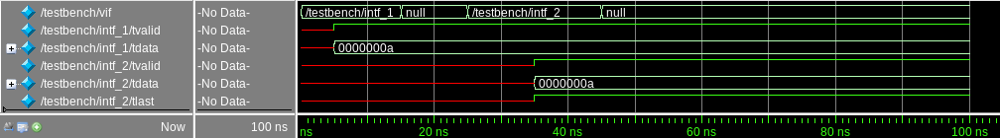

# SystemVerilog и виртуальный интерфейс. Связь статического и динамического мира симуляции.

Вместе с большим количеством нововведений несинтезируемого подмножества (`class`, `fork-join`, `randomize()`, `queue`, ...) SystemVerilog "порадовал" инженеров новыми синтезируемыми конструкциями. Одной из них являлся интерфейс (`interface`).

Задумка здесь очень простая. **Интерфейс** по своей сути **является сгруппированным набором сигналов**. Например, для простейшего AXI-Stream этот набор может быть объявлен следующим образом:

```verilog
interface axi_s_intf (input logic clk);

    // Simple AXI-Stream interface
    // TSTRB, TKEEP, TID, TDEST, TUSER
    // are not used for this impl.

    logic        tvalid;
    logic        tready;
    logic [31:0] tdata;
    logic        tlast;

endinterface
```

**Интерфейс обладает статической природой** (как, например, и модуль). Его экземпляр создается в нулевой момент времени симуляции и не может быть удален до ее завершения.

```verilog
module testbench;

    // Тактовый сигнал и сигнал сброса
    logic clk;
    logic aresetn;

    // Экземпляры AXI-Stream интерфейса
    axi_s_intf intf_1 (clk);
    axi_s_intf intf_2 (clk);

    // Дизайн для верификации
    my_design DUT (
        .clk      ( clk           ),
        .aresetn  ( aresetn       ),

        // AXI-Stream 1
        .tvalid_1 ( intf_1.tvalid ),
        .tready_1 ( intf_1.tready ),
        .tdata_1  ( intf_1.tdata  ),

        // AXI-Stream 2
        .tvalid_2 ( intf_2.tvalid ),
        .tready_2 ( intf_2.tready ),
        .tdata_2  ( intf_2.tdata  ),
        .tlast_2  ( intf_2.tlast  )
    );
```

Как правило, экземпляры интерфейсов объявляются в главном модуле симуляции и подключаются к интерфейсам или портам тестируемого устройства.

Заметим, что **не все провода интерфейса обязательно должны быть использованы при его подключении**. Например, в примере выше провод `tlast` для интерфейса `intf_1` не подключается.

Структурно и в системной памяти имеем следующую картину:

<p align="center">
</img>
</p>

Статические элементы в начале симуляции занимают место в памяти и существуют до завершения симуляции.

Так как в SystemVerilog появились динамические объекты (`class`), то возникла также необходимость в получении доступа из динамических объектов к статическим элементам верификационного окружения. Для этих целей и существует виртуальный интерфейс.

**Виртуальный интерфейс** - указатель на статический экземпляр интерфейса. В ходе симуляции виртуальный интерфейс может указывать на различные экземпляры.

```verilog
module testbench;

    // Тактовый сигнал и сигнал сброса
    logic clk;
    logic aresetn;

    // Экземпляры AXI-Stream интерфейса
    axi_s_intf intf_1 (clk);
    axi_s_intf intf_2 (clk);

    ...

    // Виртуальный интерфейс AXI-Stream
    virtual axi_s_intf vif;

    initial begin
        $display(vif);
        vif = intf_1;
        $display(vif);
    end

endmodule
```

Результатом запуска симуляции в таком случае будет:

```
# null
# /testbench/intf_1
```

В начале виртуальный интерфейс не указывает ни на какой из статических интерфейсов, то есть проинициализирован `null`(нулевым указателем). Строка `vif = intf_1` определяет для виртуального интерфейса статический экземпляр интерфейса, на который он будет указывать.

<p align="center">
</img>
</p>

**При помощи виртуального интерфейса пользователь может взаимодействовать с сигналами статического интерфейса**. В ходе симуляции виртуальный интерфейс может использоваться для изменения сигналов различных статических интерфейсов.

```verilog

module testbench;

    // Тактовый сигнал и сигнал сброса
    logic clk;
    logic aresetn;

    // Экземпляры AXI-Stream интерфейса
    axi_s_intf intf_1 (clk);
    axi_s_intf intf_2 (clk);

    initial begin
        clk <= 0;
        forever begin
            #5 clk <= ~clk;
        end
    end

    ...

    // Виртуальный интерфейс AXI-Stream
    virtual axi_s_intf vif;

    initial begin
        vif = intf_1;
        $display(vif);
        @(posedge clk);
        vif.tvalid <= 1;
        vif.tdata <= 10;
        @(posedge clk);
        vif = null;
        @(posedge clk);
        vif = intf_2;
        $display (vif);
        @(posedge clk);
        vif.tvalid <= 1;
        vif.tdata <= 10;
        vif.tlast <= 1;
        @(posedge clk);
        vif = null;
    end

endmodule
```

Результаты симуляции:

```
# /testbench/intf_1
# /testbench/intf_2
```

<p align="center">
</img>
</p>

Заметим, что в промежутке между присвоениями указателей на статические интерфейсы виртуальный "успел побывать" и в нулевом (`null`) значении. **В ходе симуляции указатель, содержащийся в виртуальном интерфейсе, может динамически создаваться и уничтожаться.**

Изображение ниже демонстрирует процесс создания и удаления указателя на статические интерфейсы (пример кода выше). Изначально виртуальный интерфейс указывал на `intf_1` (отмечено `-->`), после чего был проинициализирован `null`, а после стал указывать на `intf_2` (отмечено `->`).

<p align="center">
</img>
</p>

Виртуальные интерфейсы в большинстве случаев **используются для передачи в объекты классов**, в которых определен набор задач для манипулирования сигналами интерфейса.

```verilog
module testbench;

    // Тактовый сигнал и сигнал сброса
    logic clk;
    logic aresetn;

    // Экземпляры AXI-Stream интерфейса
    axi_s_intf intf_1 (clk);
    axi_s_intf intf_2 (clk);

    ...

    class my_design_driver;

        virtual axi_s_intf vif;

        function new(virtual axi_s_intf vif);
            this.vif = vif;
        endfunction

        task drive();
            @(posedge vif.clk);
            vif.tvalid <= 1;
            vif.tdata  <= $random();
            @(posedge vif.clk);
            vif.tvalid <= 0;
        endtask

    endclass

    my_design_driver driver;

    initial begin
        driver = new(intf_1);
        repeat(10) driver.drive();
    end

endmodule
```

Результат симуляции кода:

<p align="center">
</img>
</p>

В данном примере в конструктор класса `my_design_driver` передается статический интерфейс. Однако в аргументе конструктора тип аргумента объявлен как `virtual axi_s_intf`, то есть происходит присвоение `virtual axi_s_intf vif = axi_s_intf intf_1`, что является абсолютно легальным в SystemVerilog (было разобрано в примерах выше).

<p align="center">
</img>
</p>

Как видите, ничего сложного!
Больше заметок вы можете найти в Telegram-канале автора [Verification For All](https://t.me/verif_for_all).

Хорошего тебе дня, читатель, и до новых встреч!
